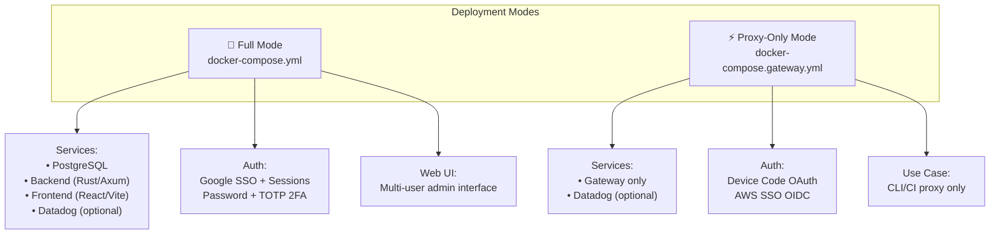
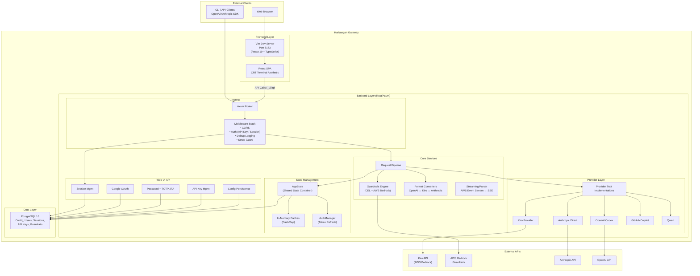
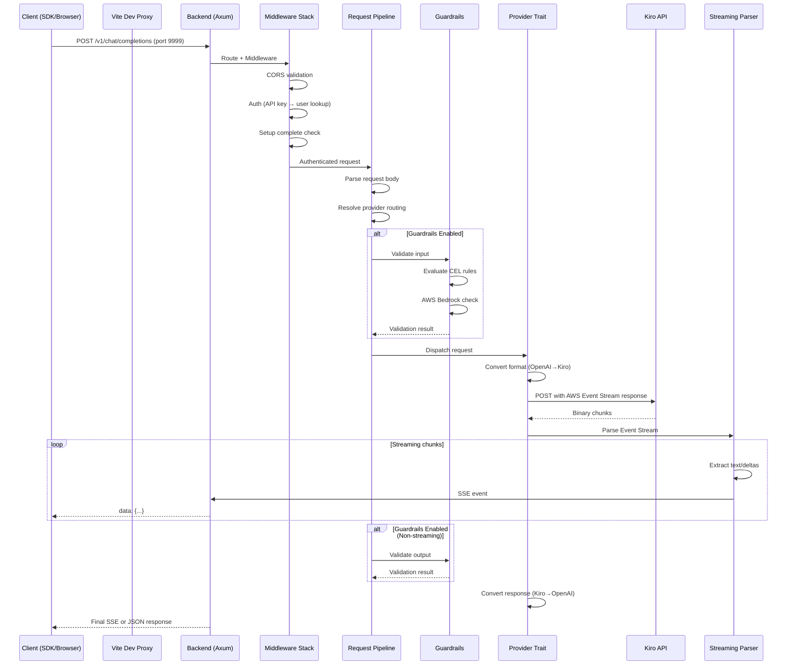
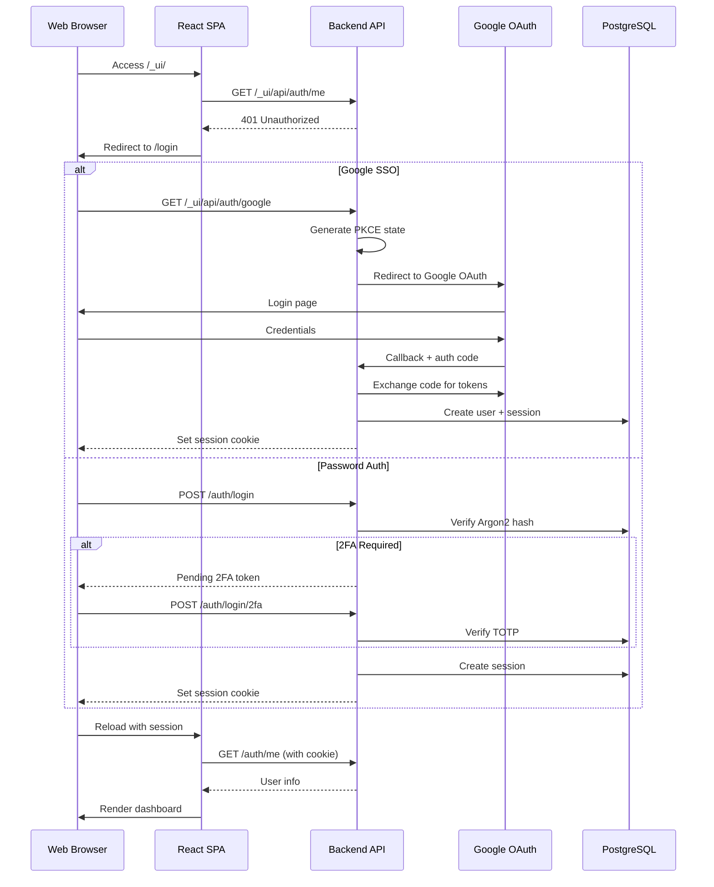
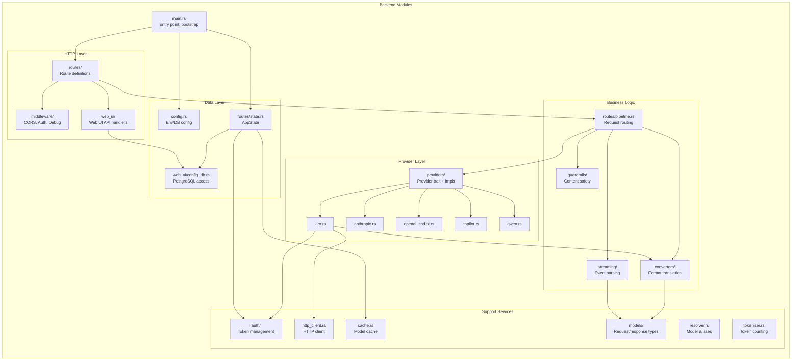
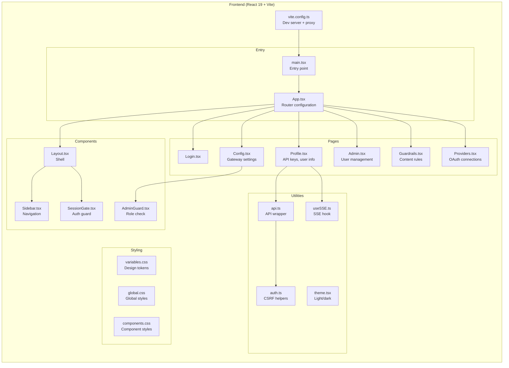
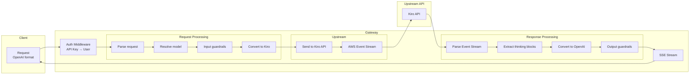
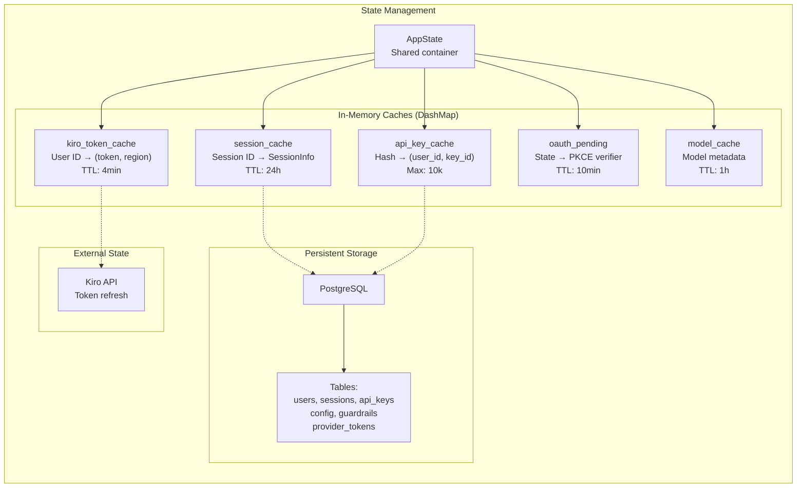
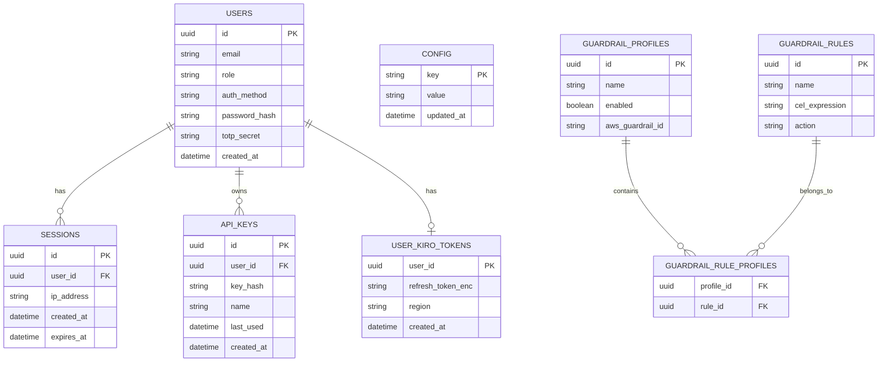
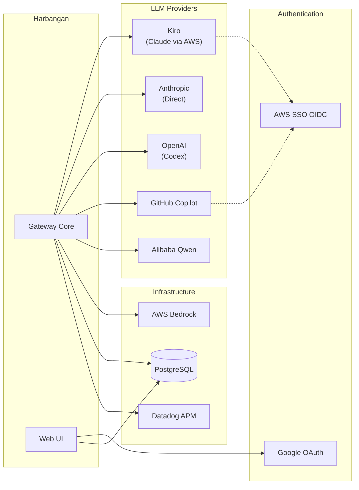

# Harbangan AI Gateway - High-Level Architecture

## System Overview

Harbangan is a multi-tenant AI gateway that proxies requests to various LLM providers (Kiro/Claude, Anthropic, OpenAI, Copilot, Qwen) with authentication, guardrails, and a Web UI for management.

## Deployment Modes

## High-Level Architecture

## Request Flow

## Web UI Authentication Flow

## Backend Module Structure

## Frontend Architecture

## Data Flow - API Request

## State & Caching Architecture

## Database Schema Overview

## External Integrations

## Key Architectural Patterns

| Pattern | Implementation |
|---------|----------------|
| **Layered Architecture** | Middleware → Routes → Pipeline → Providers → External APIs |
| **Dependency Injection** | `AppState` carries all shared dependencies |
| **Trait-Based Abstraction** | `Provider` trait abstracts all LLM backends |
| **Converter Pattern** | Bidirectional format translation between OpenAI/Anthropic/Kiro |
| **Caching Strategy** | `DashMap` for concurrent caches with TTL-based expiration |
| **Streaming with SSE** | `async-stream` for generating SSE from AWS Event Stream |
| **Fail-Open Guardrails** | On engine errors, log warning and allow request through |
| **Background Tasks** | `tokio::spawn` for token refresh, session cleanup |

## File Ownership (per Team Coordination Rules)

| File/Area | Owner Agent |
|-----------|-------------|
| `backend/src/**` | rust-backend-engineer |
| `backend/src/web_ui/config_db.rs` | database-engineer |
| `frontend/src/**` | react-frontend-engineer |
| `docker-compose*.yml`, `**/Dockerfile` | devops-engineer |
| `e2e-tests/**` | frontend-qa |
| `backend/src/**/tests/**` | backend-qa |
