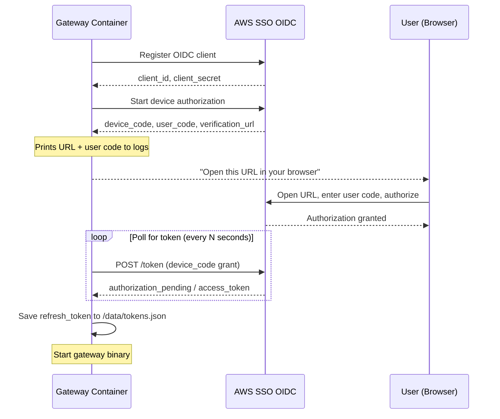
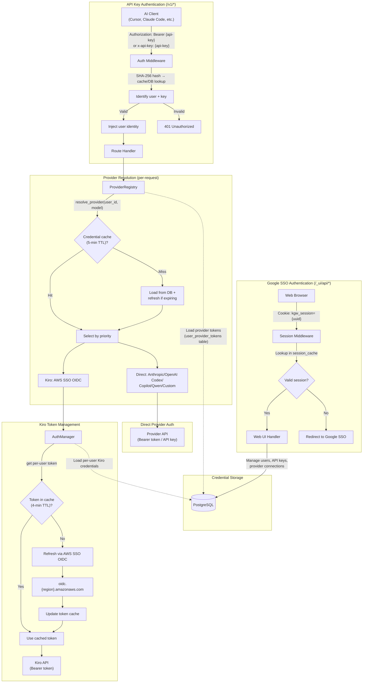
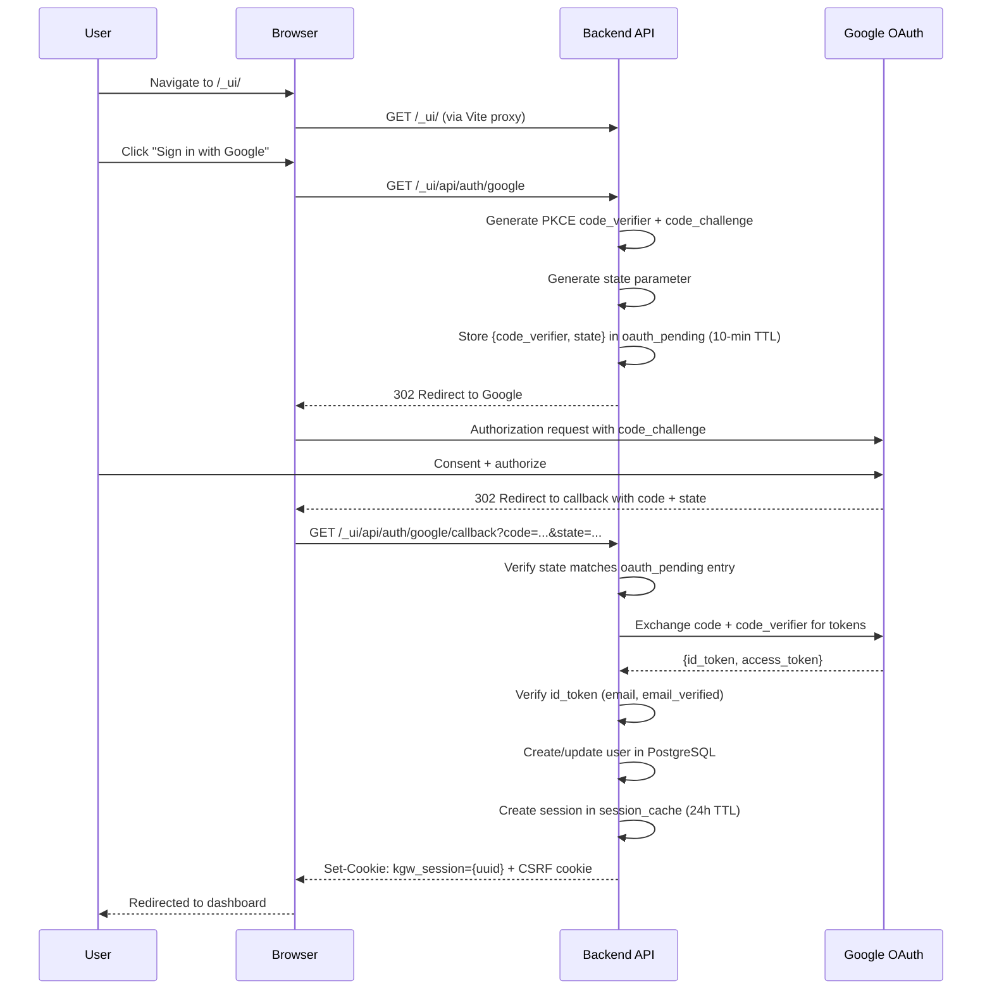
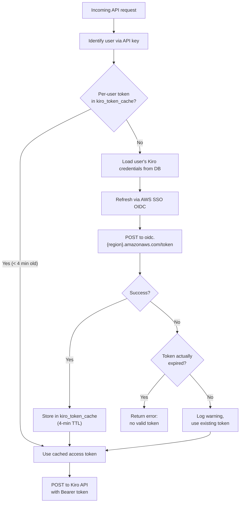
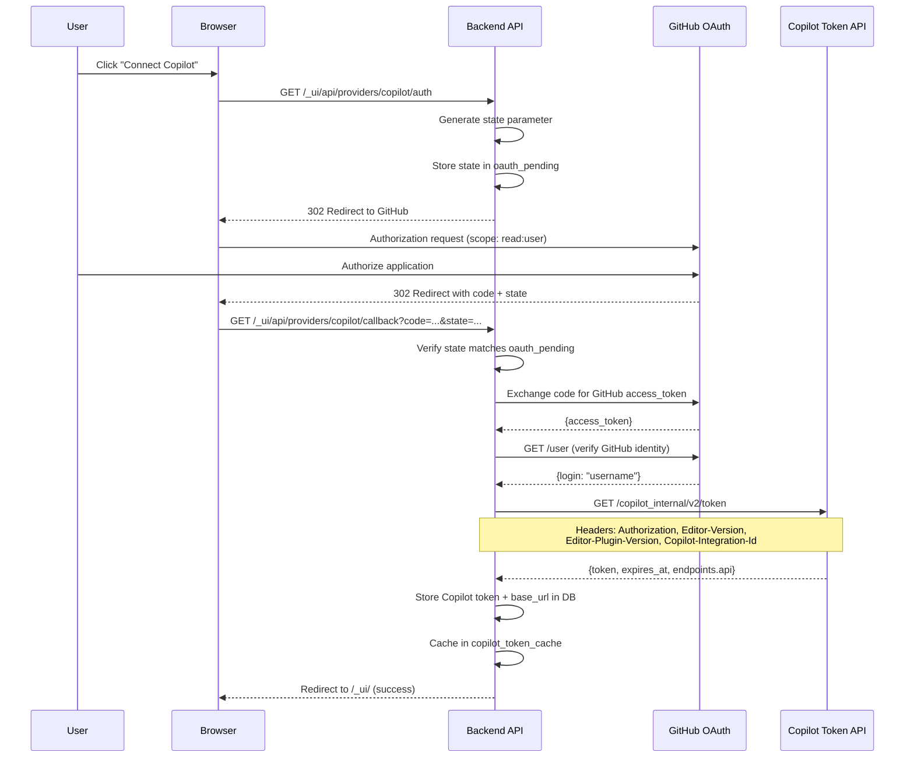
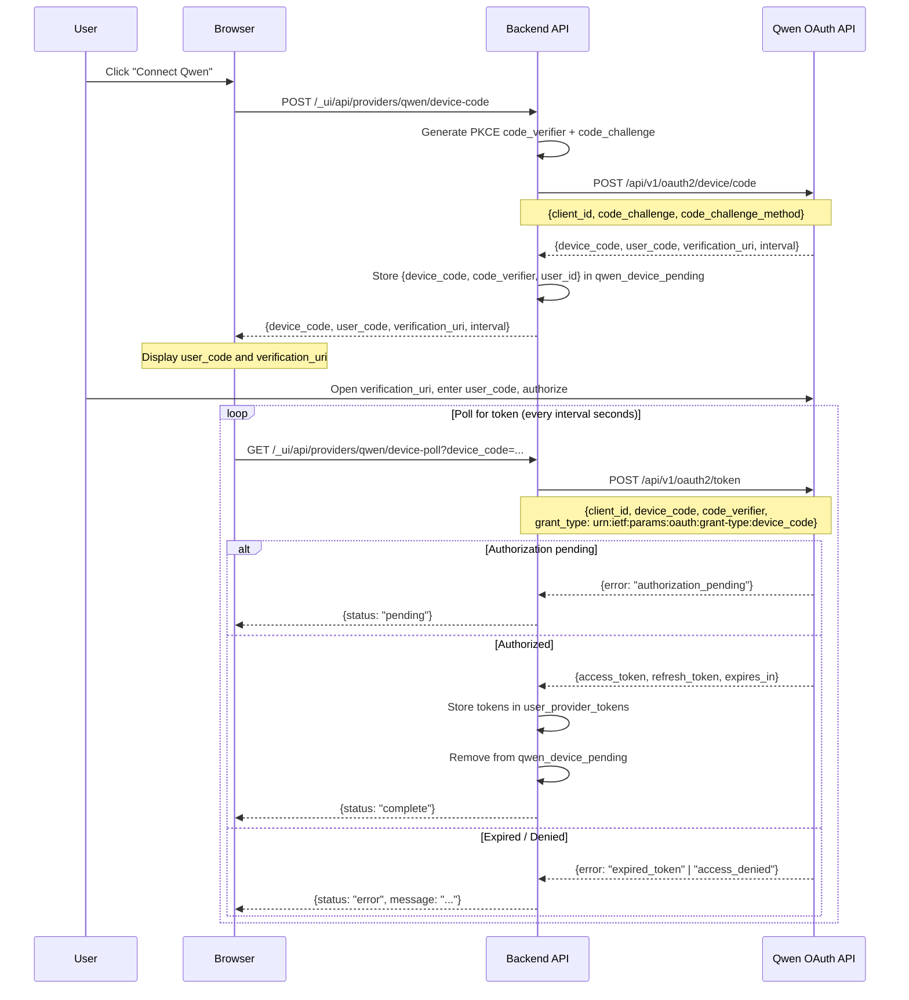
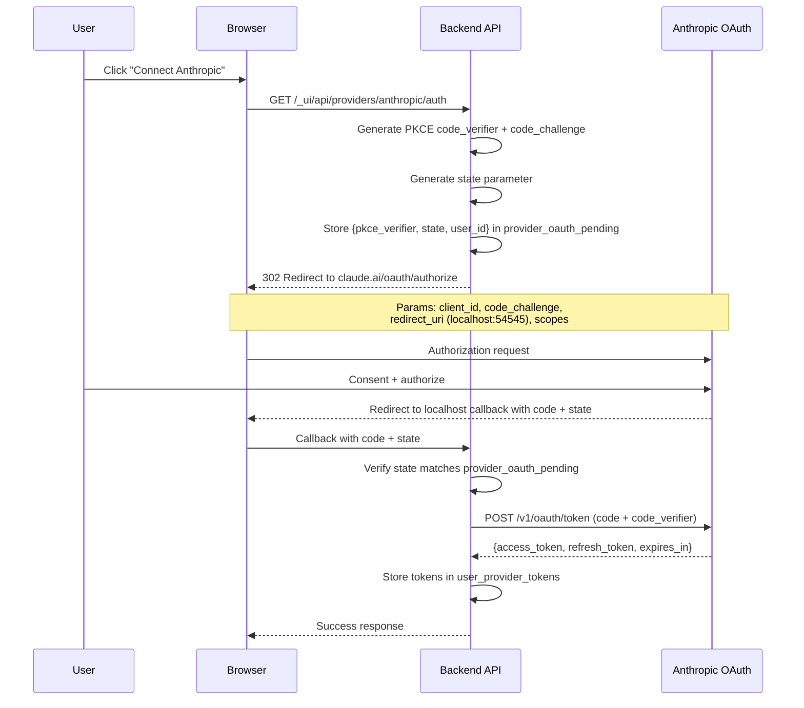
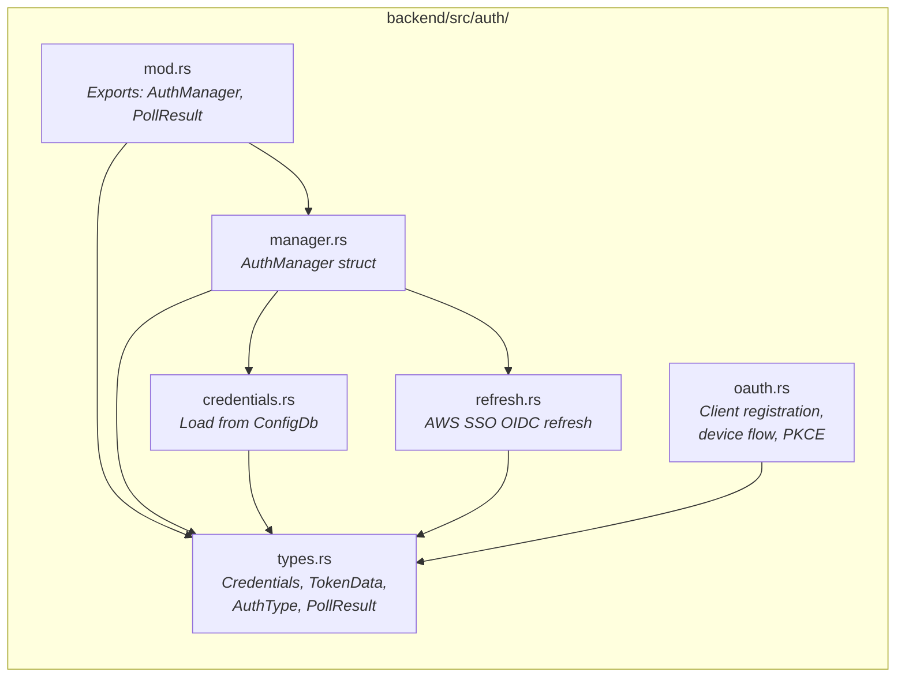
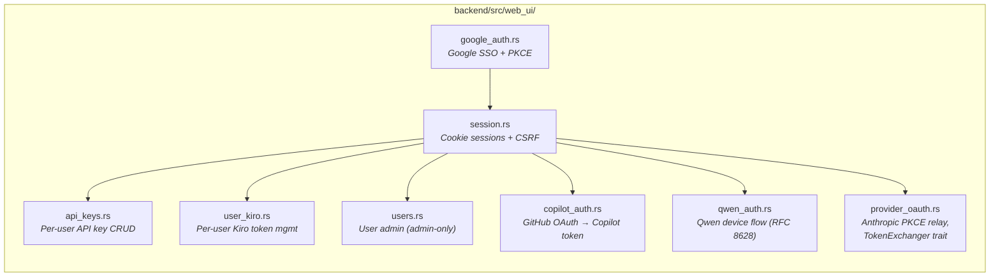

# Authentication System
{: .no_toc }

Kiro Gateway has three layers of authentication:

1. **Client authentication** — API keys for proxy endpoints (`/v1/*`), Google SSO or password+TOTP for the web UI (`/_ui/api/*`)
2. **Provider authentication** — Per-user credentials for each AI provider (Kiro, Anthropic, OpenAI Codex, Copilot, Qwen, Custom)
3. **Provider OAuth flows** — Web UI flows for connecting provider accounts (PKCE relay for Anthropic/OpenAI, GitHub OAuth for Copilot, device flow for Qwen)

The deployment mode determines which features are active:

- **Full Deployment** uses per-user API keys for proxy endpoints, Google SSO with PKCE for the web UI, per-user Kiro credentials stored in PostgreSQL, and multi-provider OAuth for connecting additional AI providers.
- **Proxy-Only Mode** uses a single `PROXY_API_KEY` for all requests and a single set of Kiro credentials obtained via an AWS SSO device code flow on first boot.

## Table of Contents
{: .no_toc .text-delta }

1. TOC
{:toc}

---

## Proxy-Only Mode Authentication

In Proxy-Only Mode (`docker-compose.gateway.yml`), authentication is simplified to a single API key and a single set of Kiro credentials.

### PROXY_API_KEY Validation

All requests to `/v1/*` endpoints must include the `PROXY_API_KEY` value:

```bash
# Via Authorization header
curl -H "Authorization: Bearer YOUR_PROXY_API_KEY" http://localhost:8000/v1/models

# Via x-api-key header
curl -H "x-api-key: YOUR_PROXY_API_KEY" http://localhost:8000/v1/models
```

The key is set via the `PROXY_API_KEY` environment variable. There is no per-user key management, no database lookup, and no web UI authentication.

### Device Code Flow (First Boot)

On first boot, the `backend/entrypoint.sh` script runs an AWS SSO OIDC device code flow to obtain Kiro credentials:



The flow supports two SSO modes:

- **Builder ID (free):** Default when `KIRO_SSO_URL` is not set. Uses `https://view.awsapps.com/start` as the start URL.
- **Identity Center (pro):** Set `KIRO_SSO_URL` to your organization's SSO URL. The device flow uses your Identity Center for authorization.

### Credential Caching

Credentials are cached to `/data/tokens.json` inside the `gateway-data` Docker volume:

```json
{"refresh_token":"...","client_id":"...","client_secret":"..."}
```

On subsequent restarts:
1. The entrypoint loads cached credentials from the volume
2. Validates them with a test token refresh
3. If valid, starts the gateway immediately (no user interaction needed)
4. If expired or invalid, clears the cache and re-runs the device code flow

To force re-authorization, remove the Docker volume:

```bash
docker volume rm harbangan_gateway-data
```

---

## Full Deployment Authentication

### Authentication Architecture Overview



---

## API Key Authentication (Proxy Endpoints)

The auth middleware (`backend/src/middleware/mod.rs`) protects all `/v1/*` proxy routes using per-user API keys.

### How It Works

1. Client sends a request with an API key via `Authorization: Bearer {key}` or `x-api-key: {key}` header
2. Middleware SHA-256 hashes the key
3. Hash is looked up in `api_key_cache` (in-memory DashMap) for fast path
4. On cache miss, hash is looked up in PostgreSQL
5. If found, the user ID and key ID are extracted and per-user Kiro credentials are injected into the request context
6. If not found, a `401 Unauthorized` JSON error is returned

### Per-User API Keys

Each user can create multiple API keys through the web UI. Keys are:
- Generated as random strings and shown to the user once at creation time
- Stored as SHA-256 hashes in PostgreSQL (the plaintext key is never stored)
- Cached in `api_key_cache: Arc<DashMap<String, (Uuid, Uuid)>>` mapping hash to `(user_id, key_id)`
- Individually revocable without affecting other keys

### Routes That Bypass API Key Auth

- `GET /` — Status JSON (for load balancers)
- `GET /health` — Health check
- `/_ui/api/*` — Web UI API routes (protected by session auth instead)

---

## Google SSO Authentication (Web UI)

The web UI uses Google SSO with PKCE + OpenID Connect for user authentication. This is implemented in `backend/src/web_ui/google_auth.rs`.

### OAuth Flow



### Session Management

Sessions are managed by `backend/src/web_ui/session.rs`:

- **Session cookie**: `kgw_session` — HttpOnly, Secure, SameSite=Strict, 24-hour TTL
- **CSRF cookie**: Separate cookie for CSRF token validation on mutation requests
- **Session storage**: `session_cache: Arc<DashMap<Uuid, SessionInfo>>` — in-memory, backed by PostgreSQL for persistence across restarts
- **SessionInfo** contains: user ID, email, role (Admin/User), expiry timestamp, auth method, TOTP status, must-change-password flag
- **Sliding expiry**: Sessions automatically extend when more than 12 hours have passed since creation

### CSRF Protection

All mutation endpoints (POST, PUT, DELETE) under `/_ui/api/*` require a valid CSRF token:
- The CSRF token is set as a cookie when the session is created
- Clients must include the token in a request header for mutations
- This prevents cross-site request forgery attacks against the web UI

### Roles

| Role | Capabilities |
|------|-------------|
| Admin | Full access: manage users, update config, manage domain allowlist, manage guardrail profiles/rules, all user capabilities |
| User | Manage own API keys, manage own provider credentials, view usage |

The first user to sign in (via Google SSO or password auth) is automatically assigned the Admin role.

### Login Rate Limiting

Password login attempts are rate-limited per email address to prevent brute-force attacks:

- **Limit**: 5 failed attempts within a 15-minute window
- **Response**: `423 Account Locked` with `retry_after_secs` field
- **Tracking**: In-memory `DashMap<String, (u32, Instant)>` keyed by email
- **Reset**: Counter resets after 15 minutes of no failed attempts

### Admin-Only Feature Routes

The following feature admin routes follow the same session + CSRF pattern as other Web UI mutation endpoints:

- **Guardrails** (`/_ui/api/guardrails/*`) — CRUD for guardrail profiles and rules, test endpoint, CEL validation
- **User management** (`/_ui/api/users/*`) — List users, update roles, delete users
- **Admin user creation** (`POST /_ui/api/admin/users/create`) — Create users with password auth
- **Password reset** (`POST /_ui/api/admin/users/:id/reset-password`) — Reset user password (forces `must_change_password`)
- **Usage** (`/_ui/api/admin/usage/*`) — Global usage stats and per-user breakdown
- **Config** (`PUT /_ui/api/config`) — Update runtime configuration

---

## Password + TOTP 2FA Authentication

Implemented in `backend/src/web_ui/password_auth.rs`. This is an alternative to Google SSO for environments where Google OAuth is not available.

### Login Flow

1. `POST /_ui/api/auth/login` with `{email, password}` — Argon2 password verification
2. If TOTP is enabled: returns `{needs_2fa: true, login_token: uuid}` — pending 2FA token stored in DB (5-minute TTL)
3. `POST /_ui/api/auth/login/2fa` with `{login_token, code}` — verifies TOTP code (30s window, 1 skew tolerance) or recovery code
4. On success: creates session, sets `kgw_session` + CSRF cookies

### 2FA Setup

All password users must enable TOTP 2FA. The `SessionGate` forces redirect to `/_ui/setup-2fa` for password users without TOTP enabled.

1. `GET /_ui/api/auth/2fa/setup` — generates TOTP secret + QR URI (otpauth:// format)
2. `POST /_ui/api/auth/2fa/verify` — verifies a TOTP code and enables 2FA
3. On success: generates 8 single-use recovery codes (SHA-256 hashed in DB)

### Recovery Codes

- 8 alphanumeric codes generated on 2FA setup
- SHA-256 hashed and stored in `totp_recovery_codes` table
- Single-use: marked as `used` after successful verification
- Can be used instead of TOTP code during login

---

## Backend Authentication (Kiro API)

Each user has their own Kiro credentials (refresh token, client ID, client secret) stored in PostgreSQL. The `AuthManager` (`backend/src/auth/manager.rs`) handles per-user token lifecycle.

### Per-User Token Flow



The `kiro_token_cache: Arc<DashMap<Uuid, (String, String, Instant)>>` maps user IDs to `(access_token, region, cached_at)` tuples. Tokens are refreshed when older than 4 minutes.

### Kiro Credential Setup

Users configure their Kiro credentials through the web UI. The credentials are stored in PostgreSQL per-user:

| Field | Description |
|-------|-------------|
| `kiro_refresh_token` | OAuth refresh token for Kiro API |
| `kiro_region` | AWS region for API calls (e.g., `us-east-1`) |
| `oauth_client_id` | OAuth client ID from AWS SSO OIDC registration |
| `oauth_client_secret` | OAuth client secret from registration |
| `oauth_sso_region` | AWS region for the SSO OIDC endpoint |

### Token Refresh Mechanism

The token refresh uses AWS SSO OIDC (`backend/src/auth/refresh.rs`):

1. **Proactive refresh**: Tokens are refreshed before they expire. The `kiro_token_cache` 4-minute TTL ensures tokens are refreshed well within typical token lifetimes.

2. **Graceful degradation**: If refresh fails but the token hasn't actually expired yet, the gateway continues using the existing token and logs a warning.

3. **Per-user isolation**: Each user's token refresh is independent. A refresh failure for one user does not affect others.

4. **HTTP client retry**: The `KiroHttpClient` can independently refresh tokens on 403 responses and retry the request.

### The Refresh Request

The OIDC refresh (`backend/src/auth/refresh.rs:refresh_aws_sso_oidc()`) sends a JSON POST to `https://oidc.{sso_region}.amazonaws.com/token`:

```json
{
  "grantType": "refresh_token",
  "clientId": "...",
  "clientSecret": "...",
  "refreshToken": "..."
}
```

The SSO region may differ from the API region (e.g., SSO in `us-east-1` but API in `eu-west-1`). The response provides a new `access_token` and optionally a rotated `refresh_token`.

---

## Multi-Provider Authentication

Beyond the default Kiro provider, users can connect additional AI providers through the web UI. Each provider has its own OAuth flow and credential storage. Provider tokens are stored in the `user_provider_tokens` PostgreSQL table and cached in the `ProviderRegistry` with a 5-minute TTL.

### Provider Credential Storage

All provider tokens are stored per-user in PostgreSQL:

| Column | Description |
|--------|-------------|
| `user_id` | Foreign key to users table |
| `provider` | Provider identifier (`anthropic`, `openai`, `gemini`, `copilot`, `qwen`) |
| `access_token` | Current access token (encrypted at rest) |
| `refresh_token` | Refresh token for OAuth providers |
| `expires_at` | Token expiry timestamp |
| `base_url` | Optional API endpoint override |
| `priority` | Provider priority (lower = preferred) |
| `metadata` | Provider-specific metadata (JSON) |

### GitHub Copilot OAuth Flow

Copilot authentication uses a two-step process: GitHub OAuth for user authorization, then a Copilot-specific token exchange. Implemented in `backend/src/web_ui/copilot_auth.rs`.



The Copilot token includes a `base_url` from the `endpoints.api` field, which may vary (e.g., `https://api.githubcopilot.com` vs `https://api.business.githubcopilot.com` for enterprise). Tokens are cached in `copilot_token_cache: Arc<DashMap<Uuid, (String, String, Instant)>>` mapping user IDs to `(token, base_url, cached_at)`.

### Qwen Coder Device Flow

Qwen uses RFC 8628 (OAuth Device Authorization Grant) — the user authorizes on a separate device/browser. Implemented in `backend/src/web_ui/qwen_auth.rs`.



Pending device flow states are stored in `qwen_device_pending: Arc<DashMap<String, QwenDevicePending>>` with a 10-minute TTL and 10k capacity cap.

### Anthropic OAuth Relay (PKCE)

Anthropic uses a standard OAuth 2.0 authorization code flow with PKCE. The gateway acts as a relay, redirecting the user to `claude.ai/oauth/authorize` and exchanging the code for tokens. Implemented in `backend/src/web_ui/provider_oauth.rs`.



The `TokenExchanger` trait abstracts the token exchange, making it mockable for tests. Provider OAuth pending states are stored separately from Google SSO in `provider_oauth_pending: Arc<DashMap<String, ProviderOAuthPendingState>>`.

### OpenAI and Gemini (API Key Storage)

OpenAI and Gemini use simple API key authentication — no OAuth flow required. Users enter their API key in the web UI, and it's stored directly in the `user_provider_tokens` table. The key is used as-is in the `Authorization: Bearer {key}` header when making requests to the provider API.

---

## Setup-Only Mode

On first run (no admin user in DB), the gateway enters setup-only mode:

1. `setup_complete` `AtomicBool` is set to `false`
2. All `/v1/*` proxy endpoints return `503 Service Unavailable`
3. Only the web UI and health endpoints are accessible
4. The first user to complete Google SSO is assigned the Admin role
5. `setup_complete` transitions to `true` and the gateway begins serving proxy requests

This ensures the gateway cannot be used as an open proxy before authentication is configured.

---

## Auth Module Structure



---

## Web UI Auth Module Structure



---

## How Auth Integrates with the Request Flow

The authentication system touches the request flow at three points:

1. **Middleware layer** — The `auth_middleware` SHA-256 hashes the client's API key and looks up the user in cache/DB. If valid, it injects the user's identity into the request extensions. This is a fast hash + DashMap lookup, not an OAuth flow.

2. **Provider resolution** — The `ProviderRegistry` resolves which provider to use for the request based on the user's configured credentials and priority. It checks its 5-minute credential cache first, then loads from PostgreSQL on cache miss. For OAuth-based providers (Copilot, Qwen, Anthropic), it proactively refreshes tokens nearing expiry using per-provider mutexes to prevent refresh storms.

3. **Handler layer** — For Kiro-bound requests, the handler retrieves the per-user Kiro access token (from cache or via refresh). For direct providers, the `Provider` trait implementation uses the credentials from the registry to call the provider API directly.

The `KiroHttpClient` also holds its own `Arc<AuthManager>` reference for connection-level retry logic. When a request to the Kiro API returns 403, the HTTP client can independently refresh the token and retry without involving the route handler.
