# Converter & Routing Deep Dive

This note distills how Harbangan translates client API calls, chooses a model/provider, and streams results back.

## High-Level Architecture

```mermaid
flowchart LR
    subgraph Ingress["Ingress"]
        Client["OpenAI / Anthropic clients"]
        Auth["Auth & setup guards"]
    end

    subgraph Routing["Routing layer"]
        ModelRes["ModelResolver\nnormalize + Kiro/direct gate"]
        ProvReg["ProviderRegistry\nper-user creds + priority"]
    end

    subgraph Direct["Direct providers"]
        AnthroP["Anthropic"]
        OaiP["OpenAI"]
        GeminiP["Gemini"]
        CopilotP["Copilot"]
        QwenP["Qwen"]
    end

    subgraph KiroPath["Kiro path (default)"]
        Conv["Converters\nOpenAI|Anthropic → Unified → Kiro"]
        KiroAPI["Kiro API"]
        Stream["Stream parser\nAWS EventStream → thinking FSM"]
        OutFmt["Output formatters\nKiro → OpenAI/Anthropic"]
    end

    Client --> Auth --> ModelRes --> ProvReg
    ProvReg -->|direct route| Direct
    ProvReg -->|Kiro route| Conv --> KiroAPI --> Stream --> OutFmt
    Direct --> Client
    OutFmt --> Client
```

## Component Roles

- `ModelResolver` (`backend/src/resolver.rs`): normalizes Claude-style names (dash→dot minor, strips date/latest) and decides Kiro vs direct based on prefixes; unknowns default to Kiro.
- `ProviderRegistry` (`backend/src/providers/registry.rs`): per-user credential cache (5-min TTL), token auto-refresh with mutex; picks native provider vs Copilot via priority; falls back to Kiro when no valid token.
- Converters (`backend/src/converters/`): hub-and-spoke around `UnifiedMessage` in `core.rs`; inbound adapters build Kiro payloads, merge consecutive roles, sanitize tool descriptions, map text/images/tool_use/tool_result.
- Streaming: Kiro returns AWS EventStream; streaming parser + thinking FSM extract `<thinking>` blocks; outbound formatters emit OpenAI or Anthropic SSE/JSON with tool calls and usage.
- Guardrails/MCP (optional): input/output validation and tool injection happen before conversion; non-streaming output may be re-validated.

## Request Path Summary

1. Client hits the backend; CORS + auth + setup guards run.
2. Model normalization chooses Kiro vs direct; provider registry resolves per-user credentials and priorities.
3. Kiro route: converters build Kiro payload → AuthManager refreshes AWS SSO token → POST `generateAssistantResponse` → stream parsed and formatted back to client.
4. Direct route: request relayed with stored token to provider; SSE or JSON proxied back without format translation.

