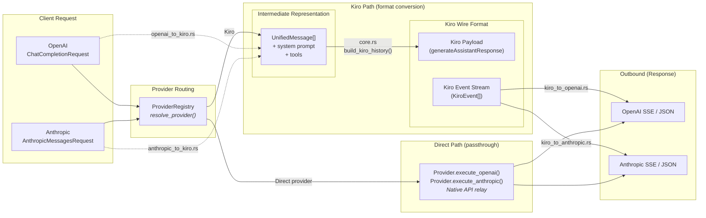
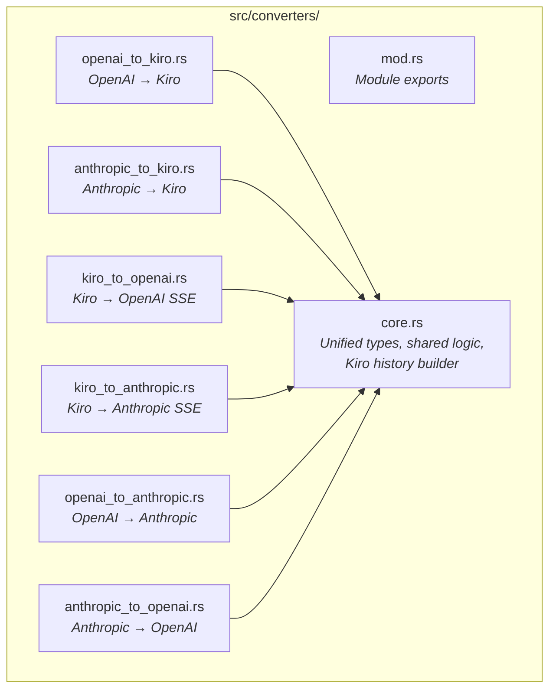
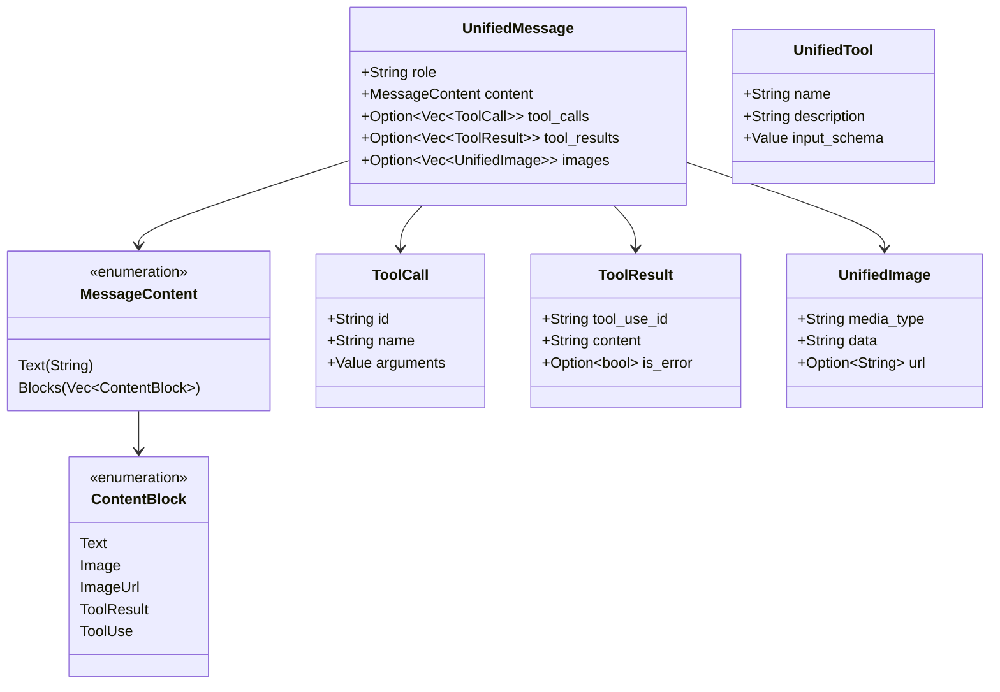
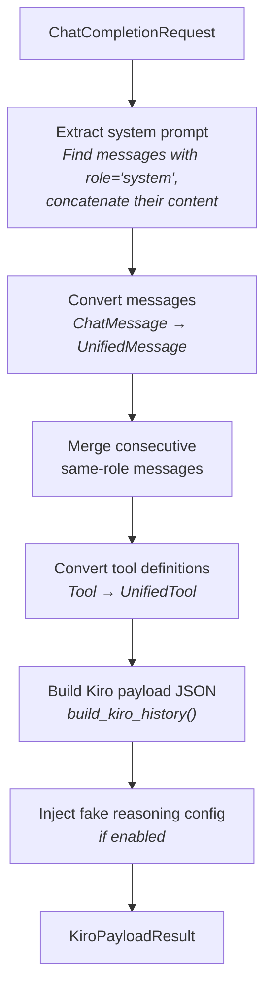
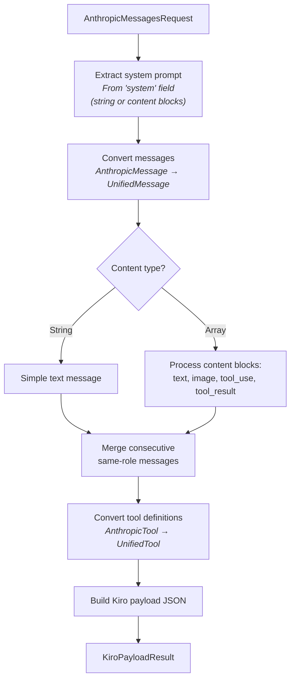
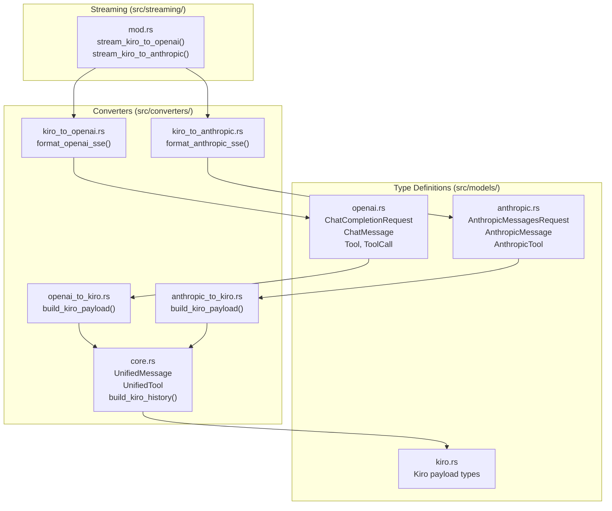

# Format Translation System
{: .no_toc }

The converter modules handle bidirectional conversion between OpenAI, Anthropic, and Kiro API formats — covering messages, tool calls, images, system prompts, and streaming events. These converters are used when requests are routed to the Kiro provider (the default). Additionally, cross-format converters (`openai_to_anthropic.rs`, `anthropic_to_openai.rs`) handle format translation when routing between direct providers (e.g., an OpenAI-format request routed to the Anthropic provider).

This page documents the converter architecture, the unified intermediate representation, and field-level mapping details.

## Table of Contents
{: .no_toc .text-delta }

1. TOC
{:toc}

---

## Converter Architecture

The conversion system uses a hub-and-spoke pattern with a unified intermediate representation at the center. Both OpenAI and Anthropic requests are first converted to `UnifiedMessage` objects, which are then transformed into the Kiro wire format. Responses flow in the opposite direction.



---

## Module Structure



| File | Direction | Responsibility |
|------|-----------|---------------|
| `core.rs` | Shared | Unified types (`UnifiedMessage`, `MessageContent`, `ToolCall`, etc.), text extraction, image processing, tool sanitization, message merging, Kiro history building |
| `openai_to_kiro.rs` | Inbound | Parse `ChatCompletionRequest`, extract system prompt from messages, convert `ChatMessage` → `UnifiedMessage`, build Kiro payload |
| `anthropic_to_kiro.rs` | Inbound | Parse `AnthropicMessagesRequest`, handle content block arrays, convert `AnthropicMessage` → `UnifiedMessage`, build Kiro payload |
| `kiro_to_openai.rs` | Outbound | Format `KiroEvent` as OpenAI SSE chunks, build non-streaming response JSON |
| `kiro_to_anthropic.rs` | Outbound | Format `KiroEvent` as Anthropic SSE events, build non-streaming response JSON |
| `openai_to_anthropic.rs` | Cross-format | Convert OpenAI `ChatCompletionRequest` → Anthropic `AnthropicMessagesRequest` (used when routing OpenAI-format requests to the Anthropic provider) |
| `anthropic_to_openai.rs` | Cross-format | Convert Anthropic `AnthropicMessagesRequest` → OpenAI `ChatCompletionRequest` (used when routing Anthropic-format requests to OpenAI-compatible providers) |

---

## Unified Intermediate Types

The `core.rs` module defines the API-agnostic types that all converters share. This design means the Kiro payload builder only needs to understand one format, regardless of whether the original request was OpenAI or Anthropic.



---

## Inbound Conversion: OpenAI → Kiro

The `openai_to_kiro.rs` module converts OpenAI `ChatCompletionRequest` objects into Kiro API payloads. The entry point is `build_kiro_payload()`.

### Conversion Steps



### Field Mapping: OpenAI → Kiro

| OpenAI Field | Kiro Field | Notes |
|-------------|-----------|-------|
| `messages[role="system"].content` | `conversationState.systemPrompt` | Multiple system messages are concatenated |
| `messages[role="user"].content` | `conversationState.history[].userInputMessage.content` | String or content array |
| `messages[role="assistant"].content` | `conversationState.history[].assistantResponseMessage.content` | Text content |
| `messages[role="assistant"].tool_calls` | `conversationState.history[].assistantResponseMessage.toolUses` | Converted to Kiro tool use format |
| `messages[role="tool"].content` | `conversationState.history[].userInputMessage.toolResults` | Matched by `tool_call_id` |
| `model` | Resolved via `ModelResolver` | Not sent directly; model is in the URL path |
| `temperature` | `inferenceConfig.temperature` | Passed through |
| `max_tokens` | `inferenceConfig.maxTokens` | Passed through |
| `tools` | `toolConfiguration.tools` | Schema converted to Kiro format |
| `stream` | N/A | Kiro always streams; gateway handles collection |

### Image Handling

OpenAI supports two image formats in content arrays:

1. **Base64 inline**: `{"type": "image_url", "image_url": {"url": "data:image/png;base64,..."}}`
2. **URL reference**: `{"type": "image_url", "image_url": {"url": "https://..."}}`

Both are converted to `UnifiedImage` objects. Base64 images are passed through directly. URL images are noted but may not be supported by the Kiro backend.

---

## Inbound Conversion: Anthropic → Kiro

The `anthropic_to_kiro.rs` module converts Anthropic `AnthropicMessagesRequest` objects. The entry point is `build_kiro_payload()`.

### Conversion Steps



### Field Mapping: Anthropic → Kiro

| Anthropic Field | Kiro Field | Notes |
|----------------|-----------|-------|
| `system` (string or blocks) | `conversationState.systemPrompt` | Supports both string and content block array |
| `messages[role="user"].content` | `conversationState.history[].userInputMessage.content` | String or content block array |
| `messages[role="assistant"].content` | `conversationState.history[].assistantResponseMessage.content` | Text from content blocks |
| Content block `type: "tool_use"` | `assistantResponseMessage.toolUses` | `{id, name, input}` → Kiro tool use |
| Content block `type: "tool_result"` | `userInputMessage.toolResults` | `{tool_use_id, content}` → Kiro tool result |
| Content block `type: "image"` | Image in message | `{source: {type, media_type, data}}` |
| `max_tokens` | `inferenceConfig.maxTokens` | Required in Anthropic format |
| `temperature` | `inferenceConfig.temperature` | Optional |
| `tools` | `toolConfiguration.tools` | `{name, description, input_schema}` |
| `tool_choice` | `toolConfiguration.toolChoice` | `auto`, `any`, or `{type: "tool", name: "..."}` |

### Key Difference: Content Blocks

Anthropic's message format allows mixed content types in a single message via content block arrays:

```json
{
  "role": "assistant",
  "content": [
    {"type": "text", "text": "Let me search for that."},
    {"type": "tool_use", "id": "toolu_01", "name": "search", "input": {"query": "rust axum"}}
  ]
}
```

The converter iterates through these blocks, extracting text content, tool uses, tool results, and images into the appropriate fields of `UnifiedMessage`.

---

## Shared Core Logic

The `core.rs` module provides several shared utilities used by both inbound converters:

### Message Merging

The Kiro API expects alternating user/assistant messages. When the client sends consecutive messages with the same role, `merge_consecutive_messages()` combines them into a single message with concatenated content.

### Tool Description Sanitization

Tool descriptions are truncated to `tool_description_max_length` (default: 10,000 characters) to prevent oversized payloads. The `sanitize_tool_description()` function handles this.

### Kiro History Building

`build_kiro_history()` converts the array of `UnifiedMessage` objects into the Kiro conversation history format, which uses a paired structure:

```json
{
  "conversationState": {
    "history": [
      {
        "userInputMessage": { "content": "..." },
        "assistantResponseMessage": { "content": "..." }
      }
    ],
    "currentMessage": {
      "userInputMessage": { "content": "latest user message" }
    }
  }
}
```

This paired format means the builder must group user and assistant messages into pairs, handling edge cases like:
- Multiple tool calls in a single assistant turn
- Tool results that need to be attached to the correct user message
- Trailing user messages that become the `currentMessage`

### Extended Thinking Injection

When `fake_reasoning_enabled` is `true`, the converter injects additional configuration into the Kiro payload that enables the model to produce `<thinking>` blocks. The `fake_reasoning_max_tokens` config controls the token budget for reasoning.

---

## Outbound Conversion: Kiro → OpenAI

The `kiro_to_openai.rs` module formats `KiroEvent` objects as OpenAI-compatible SSE chunks. This conversion happens inside the streaming pipeline (`streaming/mod.rs`).

### Event Mapping

| KiroEvent Type | OpenAI Output |
|---------------|---------------|
| `content` (regular) | `choices[0].delta.content` |
| `content` (thinking) | `choices[0].delta.reasoning_content` |
| `tool_use` | `choices[0].delta.tool_calls[{index, id, function: {name, arguments}}]` |
| `usage` | `usage: {prompt_tokens, completion_tokens, total_tokens}` |
| Stream end | `data: [DONE]\n\n` |

### Non-Streaming Response Structure

```json
{
  "id": "chatcmpl-{uuid}",
  "object": "chat.completion",
  "created": 1234567890,
  "model": "claude-sonnet-4",
  "choices": [{
    "index": 0,
    "message": {
      "role": "assistant",
      "content": "response text",
      "tool_calls": [...]
    },
    "finish_reason": "stop"
  }],
  "usage": {
    "prompt_tokens": 100,
    "completion_tokens": 50,
    "total_tokens": 150
  }
}
```

---

## Outbound Conversion: Kiro → Anthropic

The `kiro_to_anthropic.rs` module formats `KiroEvent` objects as Anthropic-compatible SSE events.

### Event Mapping

| KiroEvent Type | Anthropic Output |
|---------------|-----------------|
| Stream start | `event: message_start` with message metadata |
| `content` (regular) | `event: content_block_delta` with `text_delta` |
| `content` (thinking) | `event: content_block_delta` with `thinking_delta` |
| `tool_use` | `event: content_block_start` + `content_block_stop` with tool use block |
| `usage` | Included in `event: message_delta` |
| Stream end | `event: message_stop` |

### Non-Streaming Response Structure

```json
{
  "id": "msg-{uuid}",
  "type": "message",
  "role": "assistant",
  "model": "claude-sonnet-4",
  "content": [
    {"type": "thinking", "thinking": "reasoning content..."},
    {"type": "text", "text": "response text"},
    {"type": "tool_use", "id": "toolu_01", "name": "search", "input": {...}}
  ],
  "stop_reason": "end_turn",
  "usage": {
    "input_tokens": 100,
    "output_tokens": 50
  }
}
```

---

## Converter Relationship Diagram



---

## Design Decisions

### Why a Unified Intermediate Format?

Without `UnifiedMessage`, the codebase would need four separate conversion paths (OpenAI→Kiro, Anthropic→Kiro, Kiro→OpenAI, Kiro→Anthropic) with duplicated logic for handling images, tools, and message merging. The unified format reduces this to two inbound converters (each producing `UnifiedMessage`) and one shared Kiro payload builder, plus two outbound formatters.

### Why Merge Consecutive Messages?

The Kiro API expects strictly alternating user/assistant turns. Many clients (especially those with tool use) send multiple consecutive user or assistant messages. The merge step ensures the conversation history is valid for the Kiro backend without requiring clients to restructure their messages.

### Why Sanitize Tool Descriptions?

Some tool definitions (particularly from code editors) include extremely long descriptions or JSON schemas. The sanitization step prevents these from exceeding the Kiro API's payload limits while preserving the most important information.
