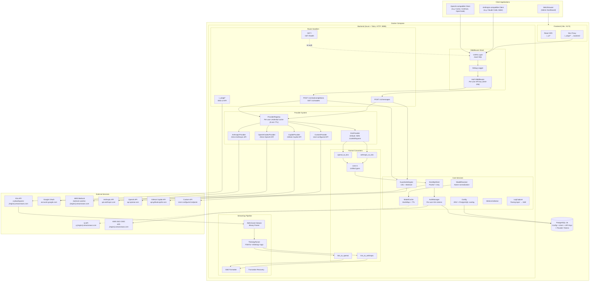
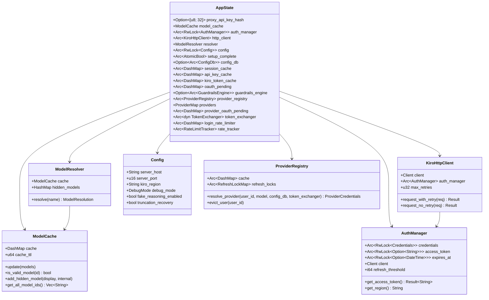
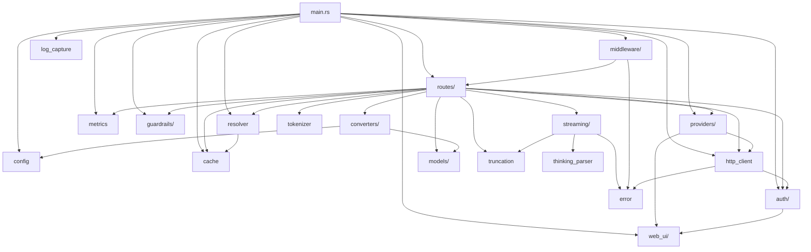

# Architecture Overview
{: .no_toc }

Harbangan is an AI proxy gateway that exposes OpenAI and Anthropic-compatible APIs backed by Kiro (AWS CodeWhisperer). It supports two deployment modes:

- **Proxy-Only Mode** (`docker-compose.gateway.yml`) — A single backend container with no database or web UI. Supports all providers (Kiro, Anthropic, OpenAI Codex, Copilot, Custom) via environment variables. Uses a single `PROXY_API_KEY` for authentication. Best for personal use.
- **Full Deployment** (`docker-compose.yml`) — Three docker-compose services: PostgreSQL database, Rust backend (plain HTTP), and Vite frontend dev server. Supports multi-user with Google SSO, per-user API keys, and per-user Kiro credential management. Best for teams and development. Production targets Kubernetes.

Both modes share the same Rust backend binary — `GATEWAY_MODE=proxy` activates the proxy-only path.

## Table of Contents
{: .no_toc .text-delta }

1. TOC
{:toc}

---

## High-Level System Diagram

The gateway sits between AI clients (any tool that speaks the OpenAI or Anthropic protocol) and multiple AI provider backends. It handles authentication, multi-provider routing, format translation, streaming, and extended thinking extraction transparently.

### Full Deployment



---

### Proxy-Only Mode

In Proxy-Only Mode, the architecture is a single container:

```
Client → gateway container (:8000, plain HTTP)
            ├── Auth: PROXY_API_KEY validation
            ├── Format conversion (OpenAI/Anthropic → Kiro)
            ├── Streaming pipeline (AWS Event Stream → SSE)
            └── Kiro API (codewhisperer.{region}.amazonaws.com)
```

No database or web UI. Kiro credentials are obtained once via a device code flow and cached to a Docker volume (`gateway-data:/data/tokens.json`).

---

## Docker Services

### Full Deployment Services

The Full Deployment runs as three docker-compose services:

| Service | Image | Purpose |
|---------|-------|---------|
| `db` | PostgreSQL 16 | Persistent storage for config, users, API keys, Kiro credentials |
| `backend` | Custom (Rust) | Axum API server on port 9999 (plain HTTP) |
| `frontend` | Custom (Vite) | Dev server serving React SPA, proxies API to backend |

```
frontend (Vite, :5173)
  ├── /_ui/*           → React SPA (hot reload)
  └── /_ui/api/*       → proxy → backend:9999
backend (:9999)        → Rust API server (plain HTTP)
db                     → PostgreSQL 16
```

---

## Application State (AppState)

All Axum route handlers share a single `AppState` struct via Axum's state extraction. This struct is the central nervous system of the gateway — it holds references to every core service.



Key design decisions for AppState:

- `auth_manager` is wrapped in `tokio::sync::RwLock` so it can be swapped at runtime after re-authentication via the Web UI.
- `config` uses `std::sync::RwLock` since config reads are synchronous and fast.
- `model_cache` uses `DashMap` internally for lock-free concurrent reads.
- `setup_complete` is an `AtomicBool` that gates API routes — when `false`, only the Web UI and health endpoints are accessible.
- `session_cache` maps session UUIDs to `SessionInfo` for web UI sessions (Google SSO and password auth).
- `api_key_cache` maps SHA-256 hashed API keys to `(user_id, key_id)` tuples for fast per-user auth lookup.
- `kiro_token_cache` stores per-user Kiro access tokens with a 4-minute TTL.
- `oauth_pending` stores PKCE state during OAuth flows with a 10-minute TTL and 10k capacity cap.
- `provider_registry` resolves which provider (Kiro, Anthropic, OpenAI Codex, Copilot, Custom) to use for a given user + model, with a 5-minute credential cache and proactive token refresh.
- `providers` is a `ProviderMap` (HashMap keyed by `ProviderId`) holding all non-Kiro provider implementations.
- `provider_oauth_pending` stores PKCE state for provider OAuth relay flows (Anthropic), separate from Google SSO's `oauth_pending`.
- `login_rate_limiter` tracks per-email login attempt counts for password auth rate limiting (5 attempts, 15-min lockout).
- `rate_tracker` tracks per-account rate limits for multi-account load balancing across providers.

---

## Module Dependency Graph

The following diagram shows how the Rust modules depend on each other. Arrows point from the dependent module to the dependency.



---

## Technology Stack

| Layer | Technology | Purpose |
|-------|-----------|---------|
| HTTP Server | [Axum 0.7](https://github.com/tokio-rs/axum) | Async web framework with type-safe extractors |
| Async Runtime | [Tokio](https://tokio.rs/) | Multi-threaded async runtime |
| Middleware | [tower](https://github.com/tower-rs/tower) / tower-http | Composable middleware layers (CORS, logging) |
| HTTP Client | [reqwest](https://github.com/seanmonstar/reqwest) | Connection-pooled HTTP client with TLS |
| Serialization | [serde](https://serde.rs/) + serde_json | JSON serialization/deserialization |
| Database | [sqlx](https://github.com/launchbadge/sqlx) (PostgreSQL) | Async PostgreSQL for users, API keys, config persistence |
| Caching | [DashMap](https://github.com/xacrimon/dashmap) | Lock-free concurrent hash map (models, sessions, API keys, tokens) |
| Logging | [tracing](https://github.com/tokio-rs/tracing) | Structured, async-aware logging with web UI capture |
| Token Counting | [tiktoken-rs](https://github.com/zurawiki/tiktoken-rs) | GPT-compatible tokenizer (cl100k_base) |
| CEL Engine | [cel-interpreter](https://github.com/clarkmcc/cel-rust) | Common Expression Language for guardrail rule conditions |
| Frontend | React 19 + Vite 7 + TypeScript 5.9 | Browser-based admin dashboard |
| APM / Observability | [Datadog](https://www.datadoghq.com/) + OpenTelemetry | Optional distributed tracing, metrics, log correlation, and frontend RUM |

---

## Design Principles

### 1. Multi-Provider Protocol Translation

The gateway does not implement its own LLM logic. It is a protocol translator and provider router: it accepts requests in OpenAI or Anthropic format, resolves the target provider via the `ProviderRegistry`, and either translates to the Kiro wire format (for the default Kiro provider) or relays directly to the provider's native API (Anthropic, OpenAI Codex, Copilot, Custom). The `Provider` trait (`providers/traits.rs`) defines a uniform interface that all providers implement, supporting both OpenAI-format and Anthropic-format inputs. The `converters/core.rs` module defines a `UnifiedMessage` type that serves as the intermediate representation for Kiro-bound requests.

### 2. Plain HTTP Backend

The Rust backend runs plain HTTP. In production (Kubernetes), TLS is handled by the Ingress controller.

### 3. Streaming-First Architecture

The Kiro API always returns responses in AWS Event Stream binary format, even for non-streaming requests. The gateway's streaming pipeline (`streaming/mod.rs`) is the primary response path. Non-streaming responses are simply collected from the stream into a single JSON object.

### 4. Graceful Degradation

The auth system implements graceful degradation: if a token refresh fails but the current token hasn't expired yet, the gateway continues serving requests with the existing token. This prevents transient OIDC failures from causing immediate outages.

### 5. Setup-First Mode

On first run (no admin user in DB), the gateway blocks `/v1/*` proxy endpoints with 503 and only serves the web UI. The first user to complete Google SSO setup is assigned the admin role. Once setup is complete, the gateway transitions to full operation without a restart.

### 6. Per-User Isolation (Full Deployment)

In Full Deployment, each user has their own API keys and Kiro credentials. The middleware identifies users by SHA-256 hashing the provided API key, looking up the user in cache/DB, and injecting per-user Kiro credentials into the request context.

In Proxy-Only Mode, a single `PROXY_API_KEY` is used for all requests, and a single set of Kiro credentials (obtained via device code flow) serves all traffic.

### 7. Pipeline Extensibility (Guardrails)

Input guardrails run before format conversion, output guardrails run after response collection (non-streaming only). Guardrails are optional (disabled by default) and fail-open to avoid blocking requests on infrastructure errors.

### 8. Opt-In Observability (Datadog APM)

Datadog APM is zero-overhead when not configured. When `DD_AGENT_HOST` is set, the backend adds a Datadog layer to the `tracing_subscriber` registry — no code runs otherwise. The Datadog Agent runs as an optional Docker Compose profile (`--profile datadog`), keeping the default deployment simple. Frontend RUM is similarly opt-in via build-time `VITE_DD_*` environment variables.

---

## Source File Map

| File | Description |
|------|-------------|
| `backend/src/main.rs` | Entry point, startup orchestration, Axum app builder |
| `backend/src/config.rs` | Configuration from ENV + `.env` + PostgreSQL overlay |
| `backend/src/error.rs` | `ApiError` enum with `IntoResponse` for HTTP error mapping |
| `backend/src/cache.rs` | Thread-safe model metadata cache (DashMap) |
| `backend/src/resolver.rs` | Model name normalization and resolution pipeline |
| `backend/src/auth/` | OAuth token lifecycle (manager, credentials, refresh, oauth, types) |
| `backend/src/http_client.rs` | Connection-pooled HTTP client with retry + backoff |
| `backend/src/routes/` | Axum route handlers (`mod.rs`, `openai.rs`, `anthropic.rs`, `pipeline.rs`) and AppState (`state.rs`) |
| `backend/src/streaming/mod.rs` | AWS Event Stream parser, SSE formatters |
| `backend/src/thinking_parser.rs` | FSM for extracting `<thinking>` blocks from streams |
| `backend/src/converters/` | Bidirectional format translation (OpenAI/Anthropic/Kiro) |
| `backend/src/models/` | Request/response type definitions per API format |
| `backend/src/middleware/` | Auth (per-user API key via SHA-256), CORS, debug logging |
| `backend/src/tokenizer.rs` | Token counting with Claude correction factor |
| `backend/src/truncation.rs` | Truncation detection and recovery injection |
| `backend/src/metrics/` | Request latency, token usage, and error tracking |
| `backend/src/log_capture.rs` | Tracing capture layer for web UI SSE log streaming |
| `backend/src/guardrails/` | Content validation: CEL rule engine, AWS Bedrock guardrails, profiles/rules CRUD |
| `backend/src/providers/` | Multi-provider system: `Provider` trait, `ProviderRegistry` (credential cache + routing), implementations for Kiro, Anthropic, OpenAI Codex, Copilot, Custom, plus rate limiter |
| `backend/src/web_ui/` | Web UI API: Google SSO, password auth + TOTP 2FA, sessions, per-user API keys, Kiro tokens, config, users, usage tracking, admin pool, model registry, encryption |
| `backend/src/web_ui/copilot_auth.rs` | GitHub Copilot OAuth flow (GitHub OAuth → Copilot token exchange) |
| `backend/src/web_ui/provider_oauth.rs` | Provider OAuth relay (Anthropic PKCE flow, token exchange trait) |
