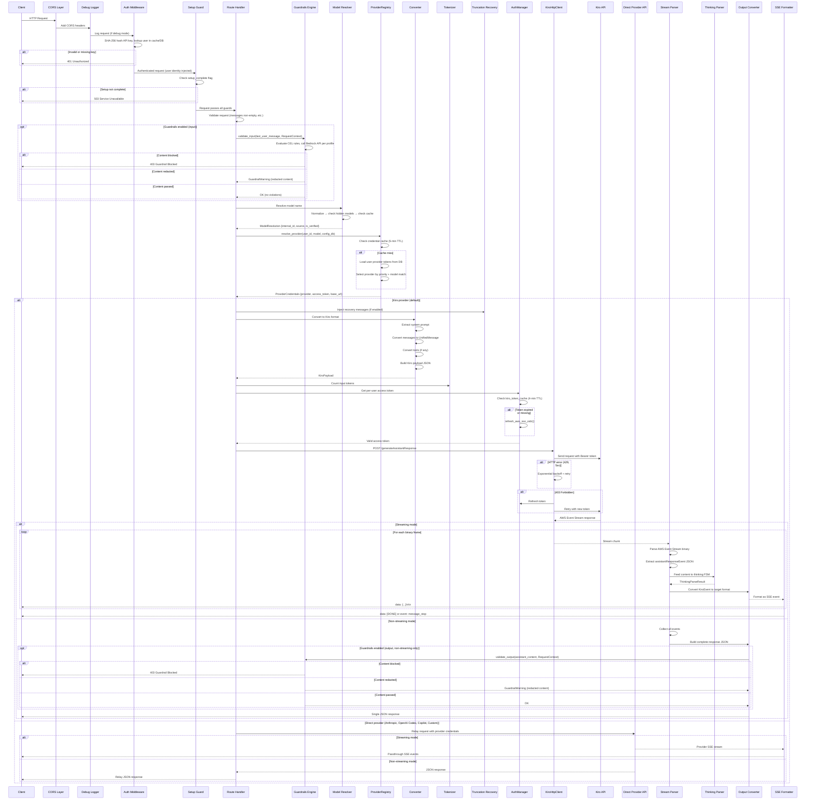
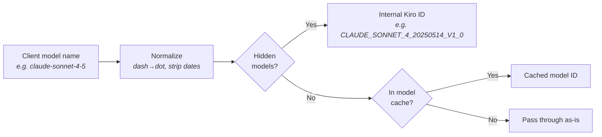
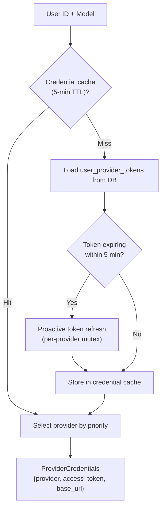
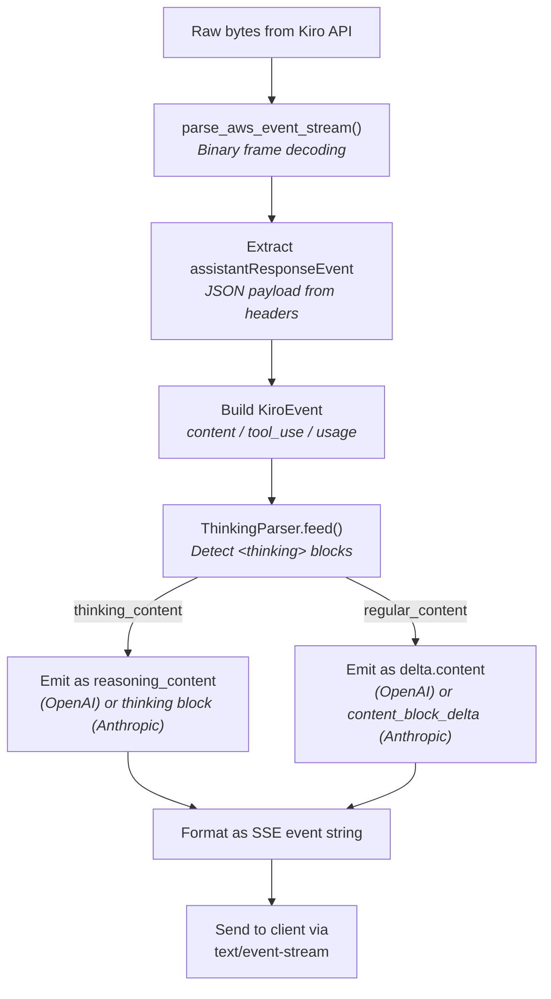
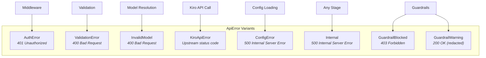

# Request Flow
{: .no_toc }

This page traces the complete lifecycle of a request through Kiro Gateway — from the moment a client sends an HTTP request to the final SSE event delivered back. Both OpenAI and Anthropic request paths are covered, along with streaming vs non-streaming differences and error handling at each stage.

## Table of Contents
{: .no_toc .text-delta }

1. TOC
{:toc}

---

## Complete Request Lifecycle

Every request passes through the backend's middleware and handler pipeline. The differences between OpenAI and Anthropic paths are in the converter modules used for format translation.



---

## Step-by-Step Walkthrough

### Step 1: Middleware Stack

Requests pass through the backend's middleware layers applied in `backend/src/main.rs:build_app()`:

1. **CORS Layer** (`middleware::cors_layer()`) — Adds permissive CORS headers (`Access-Control-Allow-Origin: *`). Handles OPTIONS preflight requests automatically via `tower-http::CorsLayer`.

2. **Debug Logger** (`middleware::debug_middleware()`) — When `debug_mode` is `Errors` or `All`, captures request/response bodies for troubleshooting. Controlled by the `DEBUG_MODE` config.

### Step 2: Authentication

Auth middleware is applied per-route group, not globally. Health check routes (`/`, `/health`) and Web UI routes (`/_ui/api/*`) bypass API key authentication.

For protected routes (`/v1/chat/completions`, `/v1/messages`, `/v1/models`), the middleware in `backend/src/middleware/mod.rs`:

1. Extracts the API key from `Authorization: Bearer {key}` or `x-api-key: {key}` header
2. SHA-256 hashes the key
3. Looks up the hash in `api_key_cache` (DashMap) for fast path, or PostgreSQL on cache miss
4. If found, injects the user identity and Kiro credentials into request extensions
5. If not found, returns `401 Unauthorized` JSON error

### Step 4: Setup Guard

The setup guard checks the `setup_complete` `AtomicBool`. If initial setup hasn't been completed (no admin user exists), API routes return `503 Service Unavailable` with a message directing users to the Web UI.

### Step 5: Request Validation

Each handler validates the incoming request:

- **OpenAI** (`chat_completions_handler`): Messages array must be non-empty.
- **Anthropic** (`anthropic_messages_handler`): Messages array must be non-empty and `max_tokens` must be positive. The `anthropic-version` header is logged but not required.

### Step 5.5: Input Guardrails

If `guardrails_engine` is present and enabled, the handler extracts the last user message content and builds a `RequestContext` containing `model`, `api_format`, `message_count`, `has_tools`, `is_streaming`, and `content_length`. It then calls `engine.validate_input()`.

The engine evaluates CEL expressions on each rule to determine which rules apply to this request. Matching rules are grouped by profile. For each matching profile, the engine calls the AWS Bedrock ApplyGuardrail API concurrently, with configurable sampling (0-100%). Results are aggregated:

- **No violations** → request proceeds normally
- **`Intervened`** → returns `403 Forbidden` with violation details (`GuardrailBlocked`)
- **`Redacted`** → returns `200 OK` with redacted content and a warning (`GuardrailWarning`)
- **Engine error** → fails open (request proceeds, error is logged)

### Step 6: Model Resolution

The `ModelResolver` in `backend/src/resolver.rs` normalizes client-provided model names through a multi-stage pipeline:



The resolution result includes the `source` field (`"hidden"`, `"cache"`, or `"passthrough"`) and an `is_verified` flag indicating whether the model was found in a known list.

### Step 6.5: Provider Resolution

The `ProviderRegistry` (`backend/src/providers/registry.rs`) determines which AI provider handles the request based on the user's configured credentials and provider priority:



Each user can configure multiple providers with priority ordering. The registry selects the highest-priority provider that has valid credentials. Supported providers:

| Provider | Auth Method | API Endpoint |
|----------|-----------|-------------|
| Kiro (default) | AWS SSO OIDC refresh token | `codewhisperer.{region}.amazonaws.com` |
| Anthropic | OAuth PKCE relay | `api.anthropic.com` |
| OpenAI Codex | API key (stored) | `api.openai.com` |
| Copilot | GitHub OAuth → Copilot token | `api.githubcopilot.com` |
| Custom | API key (stored) | User-configured endpoint |

For the Kiro provider, the request continues through the format conversion and streaming pipeline. For direct providers (Anthropic, OpenAI Codex, Copilot, Custom), the `Provider` trait implementation handles the request natively — relaying it to the provider's API and streaming the response back to the client.

### Step 7: Truncation Recovery Injection

When `truncation_recovery` is enabled (default: `true`), the handler calls `truncation::inject_openai_truncation_recovery()` or `truncation::inject_anthropic_truncation_recovery()` to modify the message array. If a previous response was detected as truncated, a recovery message is injected asking the model to re-emit the truncated content.

### Step 8: Format Conversion (Inbound)

The converter modules translate the client request into the Kiro wire format:

- **OpenAI path**: `converters::openai_to_kiro::build_kiro_payload()` extracts the system prompt from messages, converts each `ChatMessage` to a `UnifiedMessage`, processes tool definitions, and builds the final Kiro JSON payload.

- **Anthropic path**: `converters::anthropic_to_kiro::build_kiro_payload()` handles Anthropic's content block arrays, `tool_use`/`tool_result` blocks, and the separate `system` field.

Both converters use the shared `UnifiedMessage` type from `converters/core.rs` as an intermediate representation before building the Kiro-specific JSON.

### Step 9: Token Counting

Input tokens are estimated using `tiktoken-rs` (cl100k_base encoding) with a 1.15x Claude correction factor. This count is used for:
- Usage reporting in the response
- Metrics tracking
- Streaming metrics handles

### Step 10: Authentication Token Retrieval

The handler retrieves the per-user Kiro access token:
1. Checks `kiro_token_cache` for a cached token (4-minute TTL)
2. On cache miss, loads the user's Kiro credentials from PostgreSQL
3. Calls `refresh::refresh_aws_sso_oidc()` to get a fresh access token
4. Caches the new token in `kiro_token_cache`
5. On refresh failure, falls back to the existing token if it hasn't actually expired (graceful degradation)

### Step 11: HTTP Request to Kiro API

`KiroHttpClient::request_with_retry()` sends the request to `https://codewhisperer.{region}.amazonaws.com/generateAssistantResponse` with:
- `Authorization: Bearer {access_token}`
- `Content-Type: application/json`
- The converted Kiro payload as the JSON body

The retry logic handles:
- **403 Forbidden**: Triggers a token refresh and retries
- **429 Too Many Requests / 5xx**: Exponential backoff with 10% jitter (`delay = base_ms * 2^attempt + jitter`)
- **Other errors**: Fail immediately

### Step 12: Response Processing

The Kiro API always returns responses in AWS Event Stream binary format. The streaming module (`backend/src/streaming/mod.rs`) handles two paths:

#### Streaming Path



The streaming functions (`stream_kiro_to_openai()`, `stream_kiro_to_anthropic()`) return a `Stream<Item = Result<String, ApiError>>` that the handler wraps in an Axum `Body::from_stream()` response.

#### Non-Streaming Path

For non-streaming requests, `collect_openai_response()` or `collect_anthropic_response()` consumes the entire event stream and aggregates it into a single JSON response object. The Kiro API does not have a non-streaming mode — the gateway simulates it by collecting the stream.

### Step 12.5: Output Guardrails (Non-Streaming Only)

After collecting the complete response (non-streaming path only), the handler extracts the assistant content and calls `engine.validate_output()` with the same `RequestContext` used for input validation.

The evaluation flow is identical to input guardrails: CEL expression matching → profile grouping → concurrent Bedrock API calls → result aggregation. The same action outcomes apply (`Intervened` → 403, `Redacted` → 200 with warning, engine error → fail open).

**Important**: Output guardrails are NOT available for streaming responses. Since streaming responses are sent to the client incrementally, there is no opportunity to validate the complete output before delivery.

---

## OpenAI vs Anthropic Flow Differences

While the overall pipeline is identical, there are format-specific differences:

| Aspect | OpenAI Path | Anthropic Path |
|--------|------------|----------------|
| Endpoint | `POST /v1/chat/completions` | `POST /v1/messages` |
| System prompt | Extracted from messages array (role: "system") | Separate `system` field in request body |
| Tool calls | `tool_calls` array on assistant messages | `tool_use` content blocks |
| Tool results | `role: "tool"` messages with `tool_call_id` | `tool_result` content blocks |
| Streaming format | `data: {"choices":[{"delta":{...}}]}\n\n` | `event: content_block_delta\ndata: {...}\n\n` |
| Stream termination | `data: [DONE]\n\n` | `event: message_stop\ndata: {}\n\n` |
| Thinking content | `reasoning_content` field in delta | `thinking` content block type |
| Usage reporting | In final chunk (when `include_usage: true`) | In `message_delta` event |
| Token counting | `count_message_tokens()` + `count_tools_tokens()` | `count_anthropic_message_tokens()` |
| Guardrails input | `extract_last_user_message(&request.messages)` | `extract_last_user_message_anthropic(&request.messages)` |
| Guardrails output | `extract_assistant_content(&response)` | `extract_assistant_content_anthropic(&response)` |

---

## Error Handling at Each Stage

The gateway uses a centralized `ApiError` enum (defined in `backend/src/error.rs`) that implements Axum's `IntoResponse` trait. Each variant maps to an HTTP status code:



All errors are returned as JSON in the OpenAI error format:
```json
{
  "error": {
    "message": "descriptive error message",
    "type": "error_type"
  }
}
```

Every error is also recorded in the `MetricsCollector` with a category tag (`"auth"`, `"validation"`, `"upstream"`, `"internal"`, `"config"`) for monitoring.

---

## Request Metrics Tracking

Each request is wrapped in a `RequestGuard` (defined in `backend/src/routes/mod.rs`) that:

1. Increments `active_connections` on creation
2. Records latency, model, and token counts on completion
3. Decrements `active_connections` on drop (even if the request panics or is cancelled)

For streaming requests, a `StreamingMetricsTracker` is used instead, which tracks output tokens incrementally as they flow through the stream and records metrics when the tracker is dropped.

---

## Distributed Tracing (Datadog APM)

When Datadog APM is enabled (via `DD_AGENT_HOST`), every request through the pipeline is instrumented with OpenTelemetry spans.

### Span creation points

| Location | Span | Description |
|:---|:---|:---|
| `tower-http TraceLayer` | `HTTP {method} {path}` | Root span for every HTTP request, auto-created by middleware |
| `chat_completions_handler` | `chat_completions` | OpenAI endpoint handler span |
| `anthropic_messages_handler` | `anthropic_messages` | Anthropic endpoint handler span |
| `KiroHttpClient::request_with_retry` | `kiro_api_request` | Upstream Kiro API call span |
| `GuardrailsEngine::validate_input` | `guardrails_input` | Input validation span (when enabled) |
| `GuardrailsEngine::validate_output` | `guardrails_output` | Output validation span (when enabled) |

### Trace context propagation

The `tower-http TraceLayer` injects W3C `traceparent` headers into outbound requests to Kiro. The frontend RUM SDK (`@datadog/browser-rum-react`) propagates trace context via HTTP headers on API calls, connecting browser sessions to backend traces.

### Metrics collection points

OTLP metrics are exported alongside traces. Key collection points:

| Metric | Collected at | Dimensions |
|:---|:---|:---|
| `harbangan.requests.total` | `RequestGuard` drop | `model`, `user`, `status` |
| `harbangan.request.duration_ms` | `RequestGuard` drop | `model`, `user` |
| `harbangan.errors.total` | `MetricsCollector::record_error` | `model`, `error_type` |
| `harbangan.tokens.input` | After token counting (Step 9) | `model`, `user` |
| `harbangan.tokens.output` | `StreamingMetricsTracker` drop | `model`, `user` |

### Log correlation

When Datadog is active, logs are formatted as JSON with `dd.trace_id` and `dd.span_id` fields injected by the tracing layer. This connects log entries to their parent trace in the Datadog UI. The existing web UI SSE log streaming continues to work alongside JSON log output.
