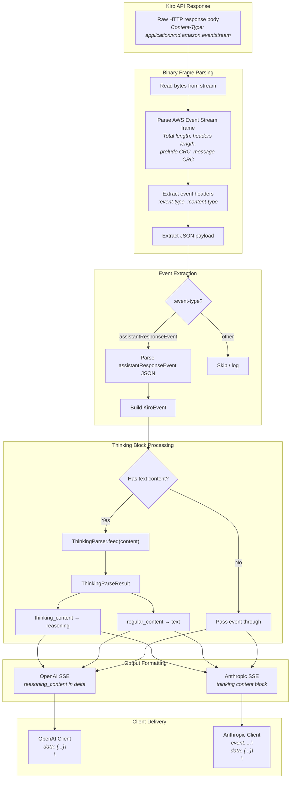
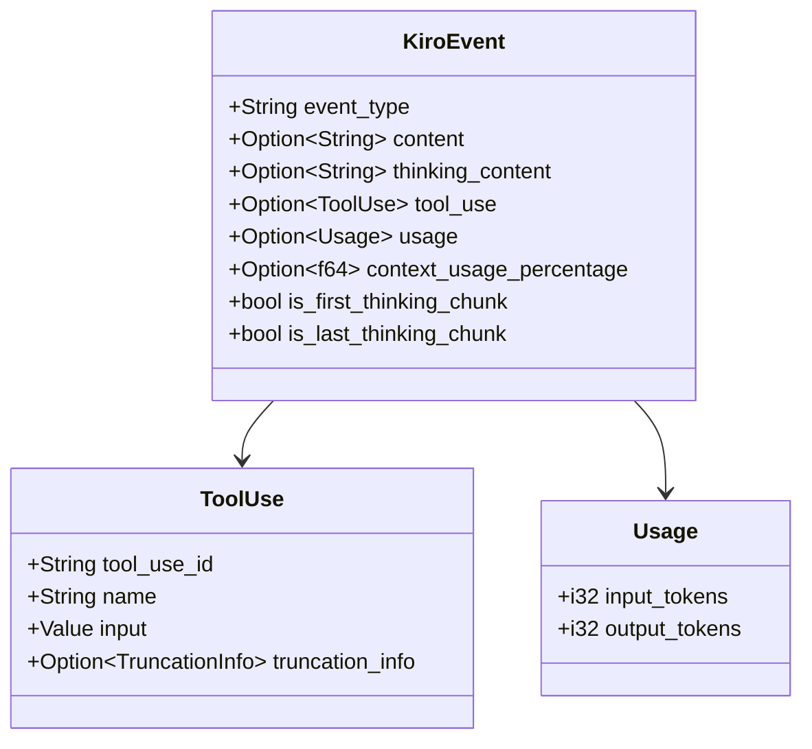
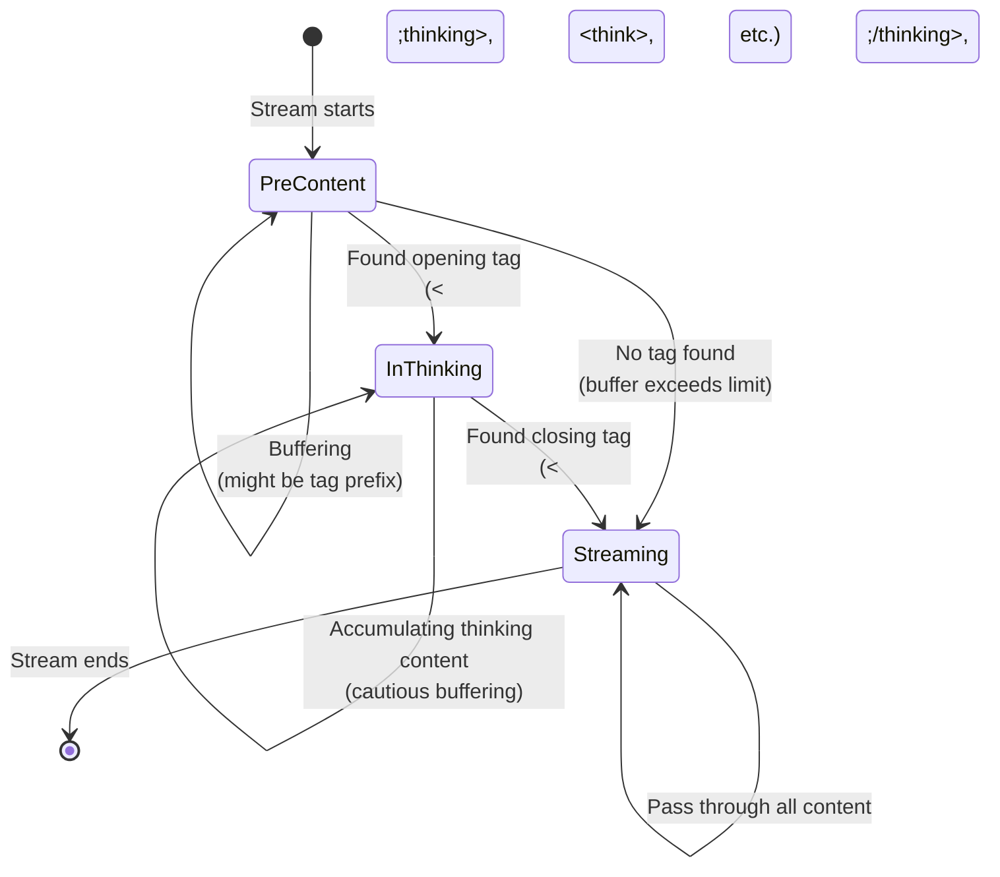
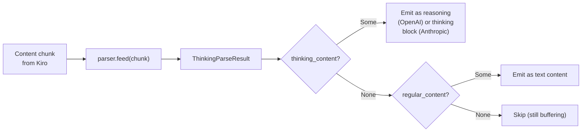
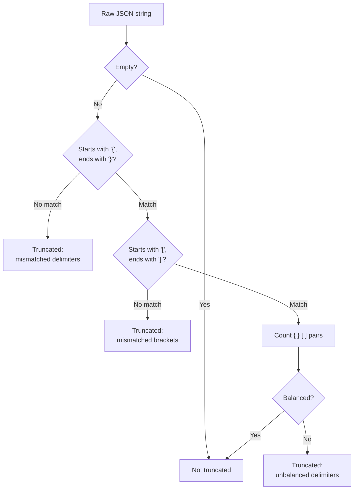
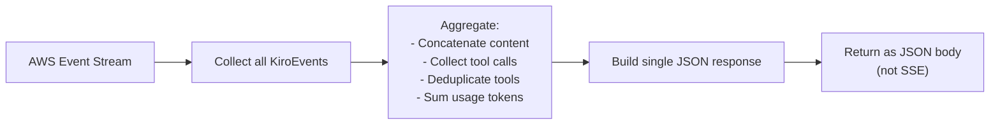

# Streaming and Event Parsing
{: .no_toc }

The Kiro API returns all responses — streaming and non-streaming — in AWS Event Stream binary format. This page covers how the gateway parses that binary protocol, extracts meaningful events, processes thinking blocks, detects truncation, and formats the output as Server-Sent Events (SSE) for OpenAI and Anthropic clients.

This streaming pipeline is specific to the Kiro provider path. When requests are routed to direct providers (Anthropic, OpenAI, Gemini, Copilot, Qwen) via the `ProviderRegistry`, the provider's `stream_openai()` / `stream_anthropic()` trait methods handle streaming natively — the response SSE stream is relayed directly to the client without binary parsing or format conversion.
{: .note }

## Table of Contents
{: .no_toc .text-delta }

1. TOC
{:toc}

---

## Streaming Pipeline Overview



---

## AWS Event Stream Binary Format

The Kiro API uses Amazon's Event Stream encoding, a binary framing protocol. Each frame has the following structure:

```
┌──────────────────────────────────────────────────┐
│ Prelude (12 bytes)                               │
│   ├─ Total byte length (4 bytes, big-endian)     │
│   ├─ Headers byte length (4 bytes, big-endian)   │
│   └─ Prelude CRC (4 bytes, CRC-32)              │
├──────────────────────────────────────────────────┤
│ Headers (variable length)                        │
│   Each header:                                   │
│   ├─ Name length (1 byte)                        │
│   ├─ Name (UTF-8 string)                         │
│   ├─ Value type (1 byte, 7 = string)             │
│   ├─ Value length (2 bytes, big-endian)          │
│   └─ Value (UTF-8 string)                        │
├──────────────────────────────────────────────────┤
│ Payload (variable length)                        │
│   JSON-encoded event data                        │
├──────────────────────────────────────────────────┤
│ Message CRC (4 bytes, CRC-32)                    │
└──────────────────────────────────────────────────┘
```

The `parse_aws_event_stream()` function in `src/streaming/mod.rs` handles this binary parsing. It reads frames from the byte stream, validates CRCs, extracts headers (particularly `:event-type`), and yields the JSON payload for `assistantResponseEvent` frames.

---

## KiroEvent Variants

After parsing the binary frame, the JSON payload is converted into a `KiroEvent` struct. The `event_type` field determines what data the event carries:

| Event Type | Description | Key Fields |
|-----------|-------------|------------|
| `content` | Text content chunk | `content: String` |
| `thinking` | Reasoning/thinking content | `thinking_content: String` |
| `tool_use` | Tool call from the model | `tool_use: {tool_use_id, name, input}` |
| `usage` | Token usage statistics | `usage: {input_tokens, output_tokens}` |
| `context_usage` | Context window utilization | `context_usage_percentage: f64` |
| `error` | Error from the API | `content: String` (error message) |



---

## Thinking Block Extraction

The `ThinkingParser` (`src/thinking_parser.rs`) is a finite state machine that detects and extracts `<thinking>` blocks from streaming content. This is critical for supporting extended thinking / chain-of-thought reasoning in models that emit their reasoning wrapped in XML-like tags.

### State Machine



### How It Works

1. **PreContent state**: The parser buffers the first ~20 characters of content, looking for an opening tag. It checks against four supported tag variants:
   - `<thinking>...</thinking>`
   - `<think>...</think>`
   - `<reasoning>...</reasoning>`
   - `<thought>...</thought>`

2. **Tag detection**: If the buffer starts with any of these tags (after stripping leading whitespace), the parser transitions to `InThinking` and records which tag was found. The corresponding closing tag is computed automatically (e.g., `<thinking>` → `</thinking>`).

3. **InThinking state**: Content is accumulated in a thinking buffer. The parser uses "cautious buffering" — it keeps the last `max_tag_length` characters in the buffer to avoid accidentally splitting a closing tag across chunks. Content before that safety margin is emitted as `thinking_content`.

4. **Closing tag detection**: When the closing tag is found, the parser transitions to `Streaming`. Content before the closing tag is emitted as the final thinking chunk. Content after the closing tag is emitted as regular content.

5. **Streaming state**: All subsequent content passes through as `regular_content` with no further processing.

### Handling Modes

The `ThinkingParser` supports four handling modes, configured via `fake_reasoning_handling` in the Config:

| Mode | Behavior |
|------|----------|
| `as_reasoning_content` | Extract thinking content to a separate `reasoning_content` field (default, OpenAI-compatible) |
| `remove` | Strip thinking blocks entirely from the output |
| `pass` | Keep the original `<thinking>` tags in the output content |
| `strip_tags` | Remove the tags but keep the thinking content inline |

### Integration with Streaming

The thinking parser is instantiated per-request inside the streaming functions. For each content chunk from the Kiro API:



---

## SSE Output Formatting

### OpenAI Format

Each streaming event is formatted as:
```
data: {"id":"chatcmpl-...","object":"chat.completion.chunk","created":...,"model":"...","choices":[{"index":0,"delta":{"content":"..."},"finish_reason":null}]}\n\n
```

For thinking content (when `fake_reasoning_enabled` is true):
```
data: {"id":"chatcmpl-...","choices":[{"index":0,"delta":{"reasoning_content":"..."},"finish_reason":null}]}\n\n
```

Stream termination:
```
data: [DONE]\n\n
```

Usage (when `include_usage` is true, sent as the final chunk before `[DONE]`):
```
data: {"id":"chatcmpl-...","choices":[],"usage":{"prompt_tokens":...,"completion_tokens":...,"total_tokens":...}}\n\n
```

### Anthropic Format

Anthropic uses named event types:
```
event: message_start
data: {"type":"message_start","message":{"id":"msg-...","type":"message","role":"assistant","model":"...","content":[],"usage":{"input_tokens":...}}}\n\n

event: content_block_start
data: {"type":"content_block_start","index":0,"content_block":{"type":"text","text":""}}\n\n

event: content_block_delta
data: {"type":"content_block_delta","index":0,"delta":{"type":"text_delta","text":"..."}}\n\n

event: content_block_stop
data: {"type":"content_block_stop","index":0}\n\n

event: message_delta
data: {"type":"message_delta","delta":{"stop_reason":"end_turn"},"usage":{"output_tokens":...}}\n\n

event: message_stop
data: {"type":"message_stop"}\n\n
```

For thinking content, a separate content block with type `thinking` is emitted before the text content block.

---

## Truncation Detection and Recovery

The Kiro API can silently truncate large responses mid-stream, particularly tool call arguments. The truncation system (`src/truncation.rs`) provides detection and recovery.

### Detection

The `diagnose_json_truncation()` function uses heuristic analysis on raw JSON strings:



### Recovery

When truncation is detected in a tool call's JSON arguments:

1. A `TruncationInfo` is attached to the `ToolUse` event
2. The truncation state is cached globally (keyed by a hash of the truncated content)
3. On the next request, `inject_openai_truncation_recovery()` or `inject_anthropic_truncation_recovery()` checks the cache and injects a recovery message asking the model to re-emit the truncated content

This creates a self-healing loop: truncated responses are detected, and the next request automatically includes context about what was lost.

---

## Non-Streaming Response Collection

For non-streaming requests, the gateway still receives an AWS Event Stream from the Kiro API. The `collect_openai_response()` and `collect_anthropic_response()` functions consume the entire stream and aggregate it:



Tool call deduplication (`deduplicate_tool_calls()`) handles a quirk of the Kiro API where the same tool call may appear multiple times in the stream. Deduplication works by:
1. Grouping by `tool_use_id` — keeping the version with the most complete arguments
2. Grouping by `name + arguments` — removing exact duplicates

---

## Key Streaming Functions

| Function | Source | Description |
|----------|--------|-------------|
| `stream_kiro_to_openai()` | `streaming/mod.rs` | Convert Kiro stream to OpenAI SSE format |
| `stream_kiro_to_anthropic()` | `streaming/mod.rs` | Convert Kiro stream to Anthropic SSE format |
| `collect_openai_response()` | `streaming/mod.rs` | Aggregate stream into single OpenAI JSON response |
| `collect_anthropic_response()` | `streaming/mod.rs` | Aggregate stream into single Anthropic JSON response |
| `parse_aws_event_stream()` | `streaming/mod.rs` | Parse binary AWS Event Stream frames |
| `deduplicate_tool_calls()` | `streaming/mod.rs` | Remove duplicate tool calls from collected stream |
| `ThinkingParser::feed()` | `thinking_parser.rs` | Process a content chunk through the thinking FSM |
| `ThinkingParser::finalize()` | `thinking_parser.rs` | Flush remaining buffers when stream ends |
| `diagnose_json_truncation()` | `truncation.rs` | Heuristic truncation detection on JSON strings |

---

## Timeout Handling

The streaming pipeline uses a `first_token_timeout` (default: 15 seconds) to detect stalled streams. If no data arrives within this window after the request is sent, the stream is aborted and an error is returned to the client. This prevents requests from hanging indefinitely when the Kiro API is unresponsive.

For ongoing streams, individual chunk timeouts are not enforced — once the first token arrives, the stream is allowed to complete at whatever pace the API delivers content.
