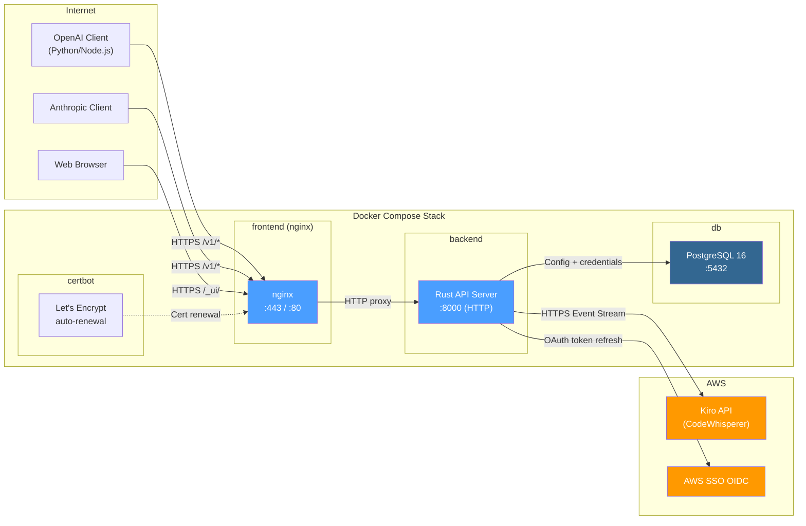

# Deployment Guide
{: .no_toc }

Production deployment instructions for Kiro Gateway. Covers both Proxy-Only Mode (single container) and Full Deployment (multi-user with TLS).
{: .fs-6 .fw-300 }

<details open markdown="block">
  <summary>Table of contents</summary>
  {: .text-delta }
1. TOC
{:toc}
</details>

---

## Deployment Modes

Kiro Gateway supports two deployment modes:

- **Proxy-Only Mode** — A single backend container with no database, web UI, or TLS. Uses `docker-compose.gateway.yml`. Best for personal use or quick evaluation.
- **Full Deployment** — Four containers (backend, PostgreSQL, nginx, certbot) with Google SSO, per-user API keys, web dashboard, and automated TLS. Uses `docker-compose.yml`. Best for teams and production.

---

## Proxy-Only Mode Deployment

### Architecture

```
Client (localhost) → gateway container (127.0.0.1:8000, plain HTTP)
                         └── Kiro API (AWS CodeWhisperer)
```

A single container running the Rust backend. No database, no nginx, no certbot. Authentication uses a single `PROXY_API_KEY` environment variable. Kiro credentials are obtained via an AWS SSO device code flow on first boot and cached to a Docker volume. The port binds to `127.0.0.1` only — not accessible from external networks. The container runs as a non-root user (`appuser`) with a 512MB memory limit.

> **Security warning:** If you override the port binding to `0.0.0.0:8000` (e.g. by editing the `ports` entry in `docker-compose.gateway.yml`), the gateway is directly reachable from any network interface with no TLS. Anyone who can reach the host on that port and knows `PROXY_API_KEY` can make API calls. Only do this behind a firewall with strict ingress rules, and use a strong randomly-generated key. The recommended approach for external access is to place a TLS-terminating reverse proxy (nginx, Caddy) in front.

| Service | Image | Purpose |
|:---|:---|:---|
| `gateway` | `kiro-gateway-backend:latest` (built locally) | Rust API server on configurable port (default 8000) |

### Prerequisites

- Docker Engine 20.10+ and Docker Compose v2
- An AWS **Builder ID** (free) or **Identity Center** (pro) account

### Step 1: Clone the Repository

```bash
git clone https://github.com/if414013/rkgw.git
cd rkgw
```

### Step 2: Configure Environment Variables

Create `.env.proxy`:

```bash
PROXY_API_KEY=your-secret-api-key
KIRO_REGION=us-east-1
# For Identity Center (pro): set your SSO URL
# KIRO_SSO_URL=https://your-org.awsapps.com/start
# KIRO_SSO_REGION=us-east-1
```

See the [Configuration Reference](configuration.html#proxy-only-mode-environment-variables) for all available variables.

### Step 3: Start the Gateway

```bash
docker compose -f docker-compose.gateway.yml --env-file .env.proxy up -d
```

On first boot, the container runs an AWS SSO device code flow. Check the logs:

```bash
docker compose -f docker-compose.gateway.yml logs -f gateway
```

You'll see a URL and user code to authorize in your browser. After authorization, credentials are cached in the `gateway-data` Docker volume and reused on subsequent restarts.

### Step 4: Verify

```bash
curl http://localhost:8000/health
# Expected: {"status":"ok"}

curl http://localhost:8000/v1/chat/completions \
  -H "Authorization: Bearer your-secret-api-key" \
  -H "Content-Type: application/json" \
  -d '{"model":"claude-sonnet-4-6","messages":[{"role":"user","content":"Hello!"}],"max_tokens":50}'
```

### Proxy-Only Mode Operations

```bash
# View logs
docker compose -f docker-compose.gateway.yml logs -f gateway

# Stop the gateway
docker compose -f docker-compose.gateway.yml down

# Restart (reuses cached credentials)
docker compose -f docker-compose.gateway.yml --env-file .env.proxy up -d

# Rebuild after code changes
docker compose -f docker-compose.gateway.yml --env-file .env.proxy up -d --build

# Re-authorize (clear cached credentials)
docker volume rm rkgw_gateway-data
docker compose -f docker-compose.gateway.yml --env-file .env.proxy up
```

### Proxy-Only Volume Layout

| Volume | Type | Purpose |
|:---|:---|:---|
| `gateway-data` | Named volume | Cached Kiro credentials (`/data/tokens.json`) |

### Adding TLS to Proxy-Only Mode

Proxy-Only Mode serves plain HTTP. To add HTTPS, place a reverse proxy in front of the gateway. For example, with [Caddy](https://caddyserver.com/):

```
your-domain.com {
    reverse_proxy localhost:8000
}
```

Or with nginx, use your existing TLS setup and proxy to `http://localhost:8000`.

---

## Full Deployment

### Architecture

The Full Deployment runs via Docker Compose with four services:



| Service | Image | Purpose |
|:---|:---|:---|
| `db` | `postgres:16-alpine` | PostgreSQL database for config, credentials, and user data |
| `backend` | `kiro-gateway-backend:latest` (built locally) | Rust API server — plain HTTP, internal only |
| `frontend` | `kiro-gateway-frontend:latest` (built locally) | nginx — serves React SPA, reverse proxies API, terminates TLS |
| `certbot` | `certbot/certbot:latest` | Automated Let's Encrypt certificate renewal (12h cycle) |

---

## Prerequisites

- Docker Engine 20.10+ and Docker Compose v2
- A server with a **public domain name** (DNS A record pointing to the server)
- **Google OAuth credentials** (Client ID + Client Secret) from the [Google Cloud Console](https://console.cloud.google.com/apis/credentials)
- At least 1 GB RAM and 2 GB disk space

---

## Step 1: Clone the Repository

```bash
git clone https://github.com/if414013/rkgw.git
cd rkgw
```

## Step 2: Configure Environment Variables

```bash
cp .env.example .env
```

Edit `.env`:

```bash
# Domain for TLS certificates (must resolve to this server)
DOMAIN=gateway.example.com

# Email for Let's Encrypt notifications
EMAIL=admin@example.com

# PostgreSQL password
POSTGRES_PASSWORD=your_secure_password_here

# Google SSO (required for Web UI authentication)
GOOGLE_CLIENT_ID=your-client-id.apps.googleusercontent.com
GOOGLE_CLIENT_SECRET=your-client-secret
GOOGLE_CALLBACK_URL=https://gateway.example.com/_ui/api/auth/google/callback

# GitHub Copilot OAuth (optional)
# GITHUB_COPILOT_CLIENT_ID=
# GITHUB_COPILOT_CLIENT_SECRET=
# GITHUB_COPILOT_CALLBACK_URL=https://gateway.example.com/_ui/api/copilot/callback

# Qwen Coder OAuth (optional — device flow, no secret required)
# QWEN_OAUTH_CLIENT_ID=f0304373b74a44d2b584a3fb70ca9e56
```

The following are managed automatically by `docker-compose.yml` — do **not** set them in `.env`:

- `SERVER_HOST` — set to `0.0.0.0` for the backend
- `SERVER_PORT` — set to `8000` for the backend
- `DATABASE_URL` — constructed from `POSTGRES_PASSWORD`

## Step 3: Provision TLS Certificates

Run the initialization script to obtain Let's Encrypt certificates:

```bash
chmod +x init-certs.sh
./init-certs.sh
```

The script:
1. Creates a temporary self-signed certificate so nginx can start
2. Starts the nginx container
3. Requests a real Let's Encrypt certificate via the ACME webroot challenge
4. Reloads nginx with the real certificate

After this, the certbot service handles automatic renewal every 12 hours.

## Step 4: Build and Start

```bash
docker compose up -d --build
```

The first build compiles the Rust backend and React frontend, which takes a few minutes. Subsequent builds are fast unless dependencies change.

Watch the logs to confirm startup:

```bash
docker compose logs -f
```

## Step 5: Complete Web UI Setup

On first launch, the backend starts in **setup-only mode** — the `/v1/*` proxy endpoints return 503 until an admin completes setup.

Open `https://your-domain.com/_ui/` and:

1. **Sign in with Google** — the first user is automatically granted the Admin role
2. **Add provider credentials** — connect Kiro (AWS SSO device code flow), and optionally GitHub Copilot or Qwen Coder on the Profile page
3. **Create an API key** — generate a personal API key for programmatic access

## Step 6: Verify

```bash
# Health check
curl https://your-domain.com/health
# Expected: {"status":"ok"}

# List models (use your personal API key)
curl -H "Authorization: Bearer YOUR_API_KEY" \
  https://your-domain.com/v1/models

# Test a chat completion
curl -X POST https://your-domain.com/v1/chat/completions \
  -H "Authorization: Bearer YOUR_API_KEY" \
  -H "Content-Type: application/json" \
  -d '{"model":"claude-sonnet-4","messages":[{"role":"user","content":"Hello!"}],"max_tokens":50}'
```

---

## Docker Compose File Reference

The `docker-compose.yml` defines four services:

```yaml
services:
  db:
    image: postgres:16-alpine
    volumes:
      - pgdata:/var/lib/postgresql/data

  backend:
    build: ./backend
    environment:
      SERVER_HOST: "0.0.0.0"
      SERVER_PORT: "8000"
      DATABASE_URL: postgres://kiro:${POSTGRES_PASSWORD}@db:5432/kiro_gateway
    depends_on:
      db: { condition: service_healthy }

  frontend:
    build: ./frontend
    ports:
      - "443:443"
      - "80:80"
    environment:
      DOMAIN: ${DOMAIN}
    volumes:
      - letsencrypt:/etc/letsencrypt:ro
      - certbot-webroot:/var/www/certbot:ro
    depends_on:
      backend: { condition: service_healthy }

  certbot:
    image: certbot/certbot:latest
    volumes:
      - letsencrypt:/etc/letsencrypt
      - certbot-webroot:/var/www/certbot
    # Renews certificates every 12 hours
```

### Volume Layout

| Volume | Type | Purpose |
|:---|:---|:---|
| `pgdata` | Named volume | PostgreSQL data (users, credentials, config, history) |
| `letsencrypt` | Named volume | Let's Encrypt certificates (shared between nginx and certbot) |
| `certbot-webroot` | Named volume | ACME challenge files for certificate verification |

---

## Day-to-Day Operations

```bash
# View live logs
docker compose logs -f

# Check container health (should show "healthy" after ~30s)
docker compose ps

# Stop the stack
docker compose down

# Rebuild after code changes
docker compose up -d --build

# Restart without rebuild
docker compose restart backend

# View backend logs only
docker compose logs -f backend
```

### Database Backup

```bash
# Dump the database
docker compose exec db pg_dump -U kiro kiro_gateway > backup.sql

# Restore from backup
docker compose exec -T db psql -U kiro kiro_gateway < backup.sql
```

---

## TLS Certificate Management

TLS is handled entirely by nginx and certbot. The backend runs plain HTTP on the internal Docker network.

### How it works

1. `init-certs.sh` obtains the initial Let's Encrypt certificate
2. nginx uses the certificate from the shared `letsencrypt` volume
3. certbot runs in the background, checking for renewal every 12 hours
4. The `/.well-known/acme-challenge/` path is served from the `certbot-webroot` volume

### Manual certificate renewal

Certificates renew automatically. To force a renewal:

```bash
docker compose run --rm certbot renew --force-renewal
docker compose exec frontend nginx -s reload
```

### Custom certificates

If you have your own certificates instead of using Let's Encrypt, place them in the letsencrypt volume at the expected path (`/etc/letsencrypt/live/YOUR_DOMAIN/fullchain.pem` and `privkey.pem`).

---

## PostgreSQL

The gateway uses PostgreSQL for persistent storage of:

- User accounts and roles
- Per-user Kiro credentials (refresh tokens)
- Per-user API keys (SHA-256 hashed)
- Runtime configuration
- Configuration change history

### Database tables

Tables are created automatically on first connection. Key tables include:

| Table | Purpose |
|:---|:---|
| `users` | User accounts (Google SSO identity, role, status) |
| `api_keys` | Per-user API keys (SHA-256 hashed, with labels) |
| `user_kiro_credentials` | Per-user Kiro refresh tokens |
| `user_provider_credentials` | Per-user provider credentials (Copilot, Qwen) |
| `user_provider_priority` | Per-user provider priority ordering |
| `config` | Key-value configuration store |
| `config_history` | Audit log of configuration changes |
| `mcp_clients` | MCP server connections (config, state, encrypted headers) |
| `guardrail_profiles` | AWS Bedrock guardrail profiles (credentials encrypted) |
| `guardrail_rules` | Guardrail rules (CEL expressions, sampling, timeouts) |

### Connection string

The `DATABASE_URL` is constructed by docker-compose from `POSTGRES_PASSWORD`:

```
postgres://kiro:<POSTGRES_PASSWORD>@db:5432/kiro_gateway
```

---

## Health Monitoring

### Health check endpoint

```bash
curl https://your-domain.com/health
```

Returns `200 OK` with:

```json
{"status":"ok"}
```

### Docker health checks

All services include built-in health checks:

```bash
docker compose ps
# NAME               SERVICE    STATUS          PORTS
# rkgw-db-1          db         Up (healthy)    5432/tcp
# rkgw-backend-1     backend    Up (healthy)    8000/tcp
# rkgw-frontend-1    frontend   Up (healthy)    0.0.0.0:443->443/tcp, 0.0.0.0:80->80/tcp
```

### Web UI metrics

The Web UI at `/_ui/` provides real-time monitoring:

- Active connections and total requests
- Latency percentiles (p50, p95, p99)
- Per-model statistics and error breakdown
- Live log streaming via SSE

### Log access

```bash
# All services
docker compose logs -f

# Backend only
docker compose logs -f backend

# Frontend (nginx) only
docker compose logs -f frontend
```

The backend uses structured logging via `tracing`:

```
INFO kiro_gateway::routes: Request to /v1/chat/completions: model=claude-sonnet-4, stream=true, messages=3
```

---

## Datadog APM (Optional)

Both deployment modes support an optional Datadog Agent sidecar for distributed tracing, metrics, log forwarding, and frontend RUM. The integration is zero-overhead when not configured — when `DD_AGENT_HOST` is unset, no Datadog code runs.

### Step 1: Configure Datadog environment variables

Add to your `.env` (Full Deployment) or `.env.proxy` (Proxy-Only):

```bash
DD_API_KEY=your-datadog-api-key
DD_SITE=datadoghq.com   # or datadoghq.eu, us3.datadoghq.com, etc.
DD_ENV=production
```

For frontend Real User Monitoring (RUM), set these **before building** the frontend image:

```bash
VITE_DD_CLIENT_TOKEN=your-rum-client-token
VITE_DD_APPLICATION_ID=your-rum-application-id
VITE_DD_ENV=production
```

| Variable | Required | Default | Description |
|:---|:---|:---|:---|
| `DD_API_KEY` | Yes | | Datadog API key |
| `DD_SITE` | No | `datadoghq.com` | Datadog intake site |
| `DD_ENV` | No | | Environment tag (e.g. `production`, `staging`) |
| `VITE_DD_CLIENT_TOKEN` | No | | RUM client token (baked into frontend bundle at build time) |
| `VITE_DD_APPLICATION_ID` | No | | RUM application ID (baked into frontend bundle at build time) |

### Step 2: Start with the Datadog profile

Add `--profile datadog` to your compose command:

```bash
# Full Deployment
docker compose --profile datadog up -d

# Proxy-Only
docker compose -f docker-compose.gateway.yml --profile datadog --env-file .env.proxy up -d
```

The `datadog-agent` service starts alongside the gateway and receives traces via OTLP on port 4317. `DD_AGENT_HOST` is set automatically by docker-compose.

### Step 3: Verify

```bash
# Check agent is running
docker compose ps datadog-agent

# Check agent logs for connectivity
docker compose logs datadog-agent | grep -i "connected\|error"
```

Traces appear in your Datadog APM dashboard within ~30 seconds of the first request.

**What you'll see in Datadog:**
- Distributed traces for every `/v1/*` request with model, user, and latency breakdown
- Metrics: request rate, error rate, latency percentiles, token usage (per model and user)
- Logs correlated to traces via injected `dd.trace_id` / `dd.span_id` fields
- Frontend RUM sessions linked to backend traces (if `VITE_DD_*` vars are set at build time)

See the [Configuration Reference](configuration.html#datadog-apm-environment-variables) for all Datadog variables and the [Architecture docs](../architecture/#observability-datadog-apm) for implementation details.

---

## Next Steps

- [Configuration Reference](configuration.html) — Environment variables for both Proxy-Only Mode and Full Deployment
- [Getting Started](getting-started.html) — Full setup walkthrough with both deployment modes
