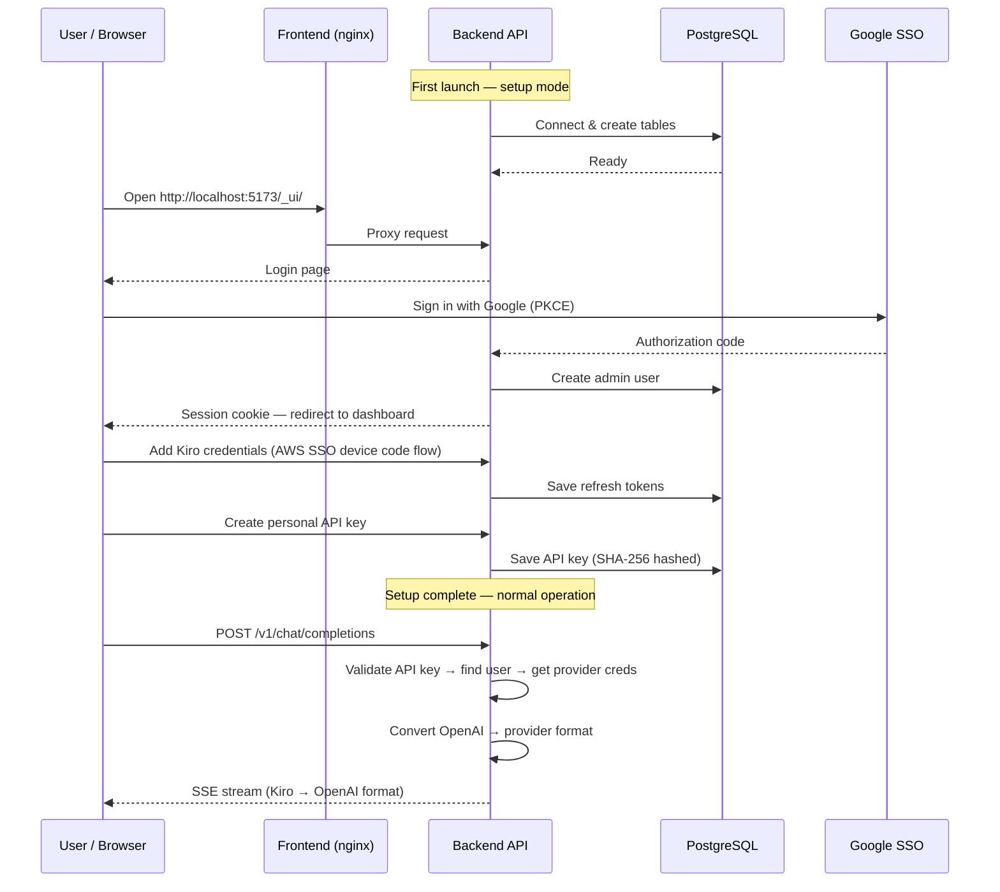

# Getting Started
{: .no_toc }

This guide walks you through setting up Harbangan for the first time. By the end, you will have a working gateway that translates OpenAI and Anthropic API calls into Kiro (AWS CodeWhisperer) backend requests.

<details open markdown="block">
  <summary>Table of contents</summary>
  {: .text-delta }
1. TOC
{:toc}
</details>

---

## What is Harbangan?

Harbangan is a proxy server that exposes industry-standard OpenAI (`/v1/chat/completions`) and Anthropic (`/v1/messages`) endpoints, translating every request into the Kiro API format used by AWS CodeWhisperer. Any tool or library that speaks the OpenAI or Anthropic protocol can use Kiro models without modification.

Key capabilities:

- Bidirectional format translation (OpenAI/Anthropic to Kiro and back)
- Streaming responses via Server-Sent Events (SSE)
- Two deployment modes: **Proxy-Only Mode** (single user) and **Full Deployment** (multi-user)
- Multiple AI providers: Kiro (AWS CodeWhisperer), Anthropic, OpenAI Codex, GitHub Copilot, Custom
- Multi-user support with Google SSO and per-user API keys (Full Deployment)
- Role-based access control (Admin / User)
- Web dashboard for configuration and usage tracking
- Content guardrails via AWS Bedrock with CEL rule engine
- Multi-provider support in both deployment modes (env vars in Proxy-Only, Admin UI in Full Deployment)
- Per-user credential management with automatic token refresh
- Model alias resolution (use familiar model names like `claude-sonnet-4`)

---

## Choose Your Deployment Mode

Harbangan supports two deployment modes:

| | Proxy-Only Mode | Full Deployment |
|:---|:---|:---|
| **Docker Compose file** | `docker-compose.gateway.yml` | `docker-compose.yml` |
| **Containers** | 1 (backend only) | 3 (backend, db, frontend) |
| **Authentication** | Single `PROXY_API_KEY` | Per-user API keys + Google SSO / Password+TOTP |
| **Kiro credentials** | Device code flow on first boot | Per-user via Web UI |
| **Database** | None | PostgreSQL |
| **Web UI** | No | Yes |
| **Best for** | Personal use, quick evaluation | Teams, development |

---

## Proxy-Only Mode

The fastest way to get started. Runs a single backend container with no database, web UI, or TLS. Supports all providers via environment variables.

### Prerequisites

| Requirement | Minimum version | How to check |
|:---|:---|:---|
| Docker | 20.10+ | `docker --version` |
| Docker Compose | 2.0+ (V2 plugin) | `docker compose version` |

You also need an **AWS Builder ID** (free) or **Identity Center** (pro) account for Kiro API access.

### Step 1: Clone the repository

```bash
git clone https://github.com/if414013/harbangan.git
cd harbangan
```

### Step 2: Configure environment variables

Copy `.env.proxy.example` to `.env.proxy` and set your values:

```bash
GATEWAY_MODE=proxy
PROXY_API_KEY=your-secret-api-key

# Optional — defaults to us-east-1:
# KIRO_REGION=us-east-1

# For Identity Center (pro): set your SSO start URL
# KIRO_SSO_URL=https://your-org.awsapps.com/start
# KIRO_SSO_REGION=us-east-1
```

### Step 3: Start the gateway

```bash
docker compose -f docker-compose.gateway.yml --env-file .env.proxy up -d
```

On first boot, the container runs an AWS SSO device code flow. Check the logs for a URL to open in your browser:

```
╔═══════════════════════════════════════════════════════════╗
║  Open this URL in your browser to authorize:             ║
║  https://device.sso.us-east-1.amazonaws.com/?user_code=… ║
╚═══════════════════════════════════════════════════════════╝
```

Open the URL, sign in with your Builder ID (free) or Identity Center (pro) account, and authorize the gateway. Credentials are cached in a Docker volume (`gateway-data`) — you only need to authorize once. On subsequent restarts, the gateway reuses the cached tokens automatically.

### Step 4: Verify it works

```bash
# Health check
curl http://localhost:8000/health
# → {"status":"ok"}

# Test a chat completion
curl http://localhost:8000/v1/chat/completions \
  -H "Authorization: Bearer your-secret-api-key" \
  -H "Content-Type: application/json" \
  -d '{
    "model": "claude-sonnet-4-6",
    "messages": [{"role": "user", "content": "Hello!"}],
    "stream": true
  }'
```

You should see a streaming SSE response with the model's reply.

{: .note }
> Proxy-Only Mode uses `http://localhost:8000` by default.

---

## Full Deployment

Multi-user mode with PostgreSQL, Google SSO, per-user API keys, and web dashboard.

### Prerequisites

| Requirement | Minimum version | How to check |
|:---|:---|:---|
| Docker | 20.10+ | `docker --version` |
| Docker Compose | 2.0+ (V2 plugin) | `docker compose version` |

Optionally, if you want Google SSO (can also use password auth):

- **Google OAuth credentials** (Client ID + Client Secret) from the [Google Cloud Console](https://console.cloud.google.com/apis/credentials). These are configured via the Admin UI after first login, not via environment variables.

### Installation

The Full Deployment runs via docker-compose with three services: PostgreSQL, Rust backend, and frontend (nginx serving the React SPA).

### Step 1: Clone the repository

```bash
git clone https://github.com/if414013/harbangan.git
cd harbangan
```

### Step 2: Configure environment variables

```bash
cp .env.example .env
```

Edit `.env` and set the required values:

```bash
# PostgreSQL password (required)
POSTGRES_PASSWORD=your_secure_password_here

# Optional: seed an admin user for password-based login (first-run only)
# INITIAL_ADMIN_EMAIL=admin@example.com
# INITIAL_ADMIN_PASSWORD=changeme
# INITIAL_ADMIN_TOTP_SECRET=JBSWY3DPEHPK3PXP
```

> **Note:** Google SSO is configured via the Admin UI after initial login, not via environment variables. You can use password auth for the first login by setting the `INITIAL_ADMIN_*` variables above.

### Step 3: Start all services

```bash
docker compose up -d --build
```

The first build compiles the Rust backend and React frontend inside Docker, which takes a few minutes. Subsequent builds are much faster.

Watch the logs:

```bash
docker compose logs -f backend
```

Wait until you see:

```
Setup not complete — starting in setup-only mode
Server listening on http://0.0.0.0:9999
```

---

## First-Time Setup Wizard

On first launch, the gateway starts in **setup-only mode**. The `/v1/*` proxy endpoints return 503 until you complete setup through the Web UI.

### Step 1: Open the Web UI

Navigate to `http://localhost:5173/_ui/` in your browser.

### Step 2: Sign in

Sign in using one of the available methods:
- **Password auth** — if you set `INITIAL_ADMIN_EMAIL` and `INITIAL_ADMIN_PASSWORD`, use those credentials. You'll be prompted to set up TOTP 2FA on first login.
- **Google SSO** — if Google SSO has been configured via the Admin UI.

The first user to sign in is automatically granted the **Admin** role.

### Step 3: Add provider credentials

Navigate to the **Providers** page to connect your AI provider credentials:
- **Kiro (AWS)** — OAuth device code flow to authenticate with AWS SSO
- **Anthropic** / **OpenAI** — PKCE OAuth relay
- **GitHub Copilot** — GitHub device code flow

### Step 4: Create an API key

Navigate to the **Profile** page and create a personal API key in the API Keys section. This key is what you'll use in `Authorization: Bearer <key>` headers when making API calls.

### Step 5: Invite users (optional)

As an admin, you can manage users from the Admin page. Create users with password auth, or enable Google SSO and manage domain allowlists under Configuration → Authentication for team access.

---

## Setup Flow Diagram



---

## Verifying the Installation

Once setup is complete, verify that everything is working.

### Health check

```bash
curl http://localhost:9999/health
```

Expected response:

```json
{"status":"ok"}
```

### List available models

```bash
curl -H "Authorization: Bearer YOUR_API_KEY" \
  http://localhost:9999/v1/models
```

### Send a test chat request (OpenAI format)

```bash
curl -X POST http://localhost:9999/v1/chat/completions \
  -H "Authorization: Bearer YOUR_API_KEY" \
  -H "Content-Type: application/json" \
  -d '{
    "model": "claude-sonnet-4",
    "messages": [
      {"role": "user", "content": "Hello! What can you do?"}
    ],
    "stream": true
  }'
```

### Send a test chat request (Anthropic format)

```bash
curl -X POST http://localhost:9999/v1/messages \
  -H "x-api-key: YOUR_API_KEY" \
  -H "Content-Type: application/json" \
  -H "anthropic-version: 2023-06-01" \
  -d '{
    "model": "claude-sonnet-4",
    "max_tokens": 1024,
    "messages": [
      {"role": "user", "content": "Hello! What can you do?"}
    ],
    "stream": true
  }'
```

### Check the Web UI dashboard

Open `http://localhost:5173/_ui/` to see:

- Profile page with API key management and security settings
- Provider management — connect Kiro, Anthropic, OpenAI, Copilot credentials
- Usage tracking — token usage by day, model, and provider
- Configuration management (admin-only)
- Content guardrails configuration (admin-only)
- User management and domain allowlist (admin-only)

---

## Connecting AI Tools

Once the gateway is running, point your AI tools at it using your personal API key.

### Cursor / VS Code extensions

Set the API base URL to your gateway:

```
http://localhost:9999/v1
```

Use your personal API key as the API key.

### OpenAI Python SDK

```python
from openai import OpenAI

client = OpenAI(
    base_url="http://localhost:9999/v1",
    api_key="YOUR_API_KEY",
)

response = client.chat.completions.create(
    model="claude-sonnet-4",
    messages=[{"role": "user", "content": "Hello!"}],
)
print(response.choices[0].message.content)
```

### Anthropic Python SDK

```python
import anthropic

client = anthropic.Anthropic(
    base_url="http://localhost:9999",
    api_key="YOUR_API_KEY",
)

message = client.messages.create(
    model="claude-sonnet-4",
    max_tokens=1024,
    messages=[{"role": "user", "content": "Hello!"}],
)
print(message.content[0].text)
```

---

## Next Steps

- [Quickstart](quickstart.html) — Get running in under 5 minutes with Docker
- [Configuration Reference](configuration.html) — Environment variables and runtime settings for both modes
- [Deployment Guide](deployment.html) — Production deployment for Proxy-Only Mode and Full Deployment
