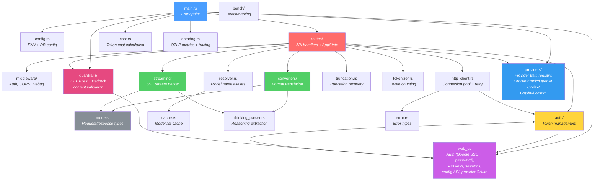

# Module Reference
{: .no_toc }

Overview of all source modules in the Harbangan codebase, their responsibilities, and how they interconnect. The gateway supports multiple AI providers (Kiro, Anthropic, OpenAI Codex, Copilot, Custom) via a `Provider` trait and `ProviderRegistry`.
{: .fs-6 .fw-300 }

  
Table of contents

  {: .text-delta }
1. TOC
{:toc}

---

## Module Relationship Diagram

---

## Module Index

### Core Application

| Module | File(s) | Description |
|--------|---------|-------------|
| `main` | `backend/src/main.rs` | Application entry point. Loads config from environment + PostgreSQL, initializes all subsystems (auth, HTTP client, model cache, metrics, log capture, provider registry), builds the Axum router, and starts the HTTP server (default port 8000, overridden to 9999 by docker-compose). |
| `lib` | `backend/src/lib.rs` | Library root. Re-exports all public modules for use by integration tests. |
| `config` | `backend/src/config.rs` | Configuration management. Defines `Config` struct with all runtime settings, `DebugMode` and `FakeReasoningHandling` enums. Loads from environment variables + `.env` file, with PostgreSQL overlay for runtime config changes via the Web UI. |
| `error` | `backend/src/error.rs` | Error types. Defines `ApiError` enum (`AuthError`, `InvalidModel`, `KiroApiError`, `ConfigError`, `ValidationError`, `Internal`) with `IntoResponse` implementation that maps each variant to an HTTP status code and JSON error body. |

### Request Handling

| Module | File(s) | Description |
|--------|---------|-------------|
| `routes` | `backend/src/routes/mod.rs`, `openai.rs`, `anthropic.rs`, `pipeline.rs`, `state.rs` | API route handlers and `AppState` definition. `mod.rs` builds separate router groups for health (unauthenticated), OpenAI (authenticated), and Anthropic (authenticated) routes. `openai.rs` handles `POST /v1/chat/completions` and `GET /v1/models`. `anthropic.rs` handles `POST /v1/messages`. `pipeline.rs` contains shared request pipeline logic. `state.rs` defines `AppState`. Manages request lifecycle with `RequestGuard` for metrics tracking. |
| `middleware` | `backend/src/middleware/mod.rs`, `backend/src/middleware/debug.rs` | Authentication, CORS, and debug logging middleware. `auth_middleware` validates API keys by SHA-256 hashing and looking up in cache/DB to identify the user and inject per-user Kiro credentials. `cors_layer()` creates a permissive CORS layer allowing all origins, methods, and headers. `debug.rs` provides request/response body logging controlled by `DebugMode`. |

### Format Translation

| Module | File(s) | Description |
|--------|---------|-------------|
| `converters` | `backend/src/converters/mod.rs` | Module root for bidirectional format translation between OpenAI/Anthropic and Kiro formats. |
| `converters::openai_to_kiro` | `backend/src/converters/openai_to_kiro.rs` | Converts OpenAI `ChatCompletionRequest` to Kiro's `KiroRequest` format. Maps messages, system prompts, tools, and conversation history. |
| `converters::anthropic_to_kiro` | `backend/src/converters/anthropic_to_kiro.rs` | Converts Anthropic `AnthropicMessagesRequest` to Kiro's `KiroRequest` format. Handles content blocks (text, images, tool use/results, thinking). |
| `converters::kiro_to_openai` | `backend/src/converters/kiro_to_openai.rs` | Converts Kiro streaming events back to OpenAI `ChatCompletionChunk` format. |
| `converters::kiro_to_anthropic` | `backend/src/converters/kiro_to_anthropic.rs` | Converts Kiro streaming events back to Anthropic `StreamEvent` format. |
| `converters::openai_to_anthropic` | `backend/src/converters/openai_to_anthropic.rs` | Converts OpenAI `ChatCompletionRequest` to Anthropic `AnthropicMessagesRequest`. Used for cross-format round-trip testing. |
| `converters::anthropic_to_openai` | `backend/src/converters/anthropic_to_openai.rs` | Converts Anthropic `AnthropicMessagesRequest` to OpenAI `ChatCompletionRequest`. Used for cross-format round-trip testing. |
| `converters::core` | `backend/src/converters/core.rs` | Shared conversion logic used by both OpenAI and Anthropic converters. Defines `UnifiedMessage`, `MessageContent`, `ToolCall`, `ToolResult`, and `UnifiedTool` types. |

### Data Models

| Module | File(s) | Description |
|--------|---------|-------------|
| `models::openai` | `backend/src/models/openai.rs` | OpenAI-compatible request/response types: `ChatCompletionRequest`, `ChatCompletionResponse`, `ChatCompletionChunk` (streaming), `ModelList`, `OpenAIModel`, `Tool`, `ToolCall`, and usage types. |
| `models::anthropic` | `backend/src/models/anthropic.rs` | Anthropic-compatible types: `AnthropicMessagesRequest`, `AnthropicMessagesResponse`, `ContentBlock` (text, thinking, image, tool_use, tool_result), `StreamEvent` variants (message_start, content_block_delta, etc.), and `Delta` types. |
| `models::kiro` | `backend/src/models/kiro.rs` | Kiro API (AWS CodeWhisperer) types: `KiroRequest` with builder methods (`with_system`, `with_tools`, `with_turns`, `with_images`), `KiroResponse`, `KiroStreamEvent`, turn-based conversation model, and tool configuration types. Uses `camelCase` serialization. |

### Authentication

| Module | File(s) | Description |
|--------|---------|-------------|
| `auth` | `backend/src/auth/mod.rs` | Module root for authentication subsystem. Re-exports `AuthManager` and related types. |
| `auth::manager` | `backend/src/auth/manager.rs` | `AuthManager` — manages per-user Kiro API authentication. Handles automatic token refresh before expiry via AWS SSO OIDC. Supports both testing mode (static token) and production mode (per-user refresh tokens from PostgreSQL). |
| `auth::oauth` | `backend/src/auth/oauth.rs` | OAuth device code flow implementation via AWS SSO OIDC. Functions for client registration (`register_client`), device authorization (`start_device_authorization`), PKCE generation, authorization URL building, code exchange, and device token polling. |
| `auth::credentials` | `backend/src/auth/credentials.rs` | Credential storage and retrieval helpers. Loads per-user Kiro credentials from PostgreSQL. |
| `auth::refresh` | `backend/src/auth/refresh.rs` | Token refresh logic. Handles automatic access token renewal using stored refresh tokens via AWS SSO OIDC. |
| `auth::types` | `backend/src/auth/types.rs` | Shared authentication types (`PollResult`, token response structures). |

### Streaming & Parsing

| Module | File(s) | Description |
|--------|---------|-------------|
| `streaming` | `backend/src/streaming/mod.rs`, `sse.rs`, `cross_format.rs` | Kiro SSE stream parser. Uses text-based `SseParser` with pattern matching and brace counting to extract JSON events from the Kiro API response stream. Entry point: `parse_kiro_stream()`. Also includes `parse_sse_stream()` for direct providers and `OpenAIToAnthropicState` for cross-format streaming. Provides `stream_kiro_to_openai()`, `stream_kiro_to_anthropic()`, `collect_openai_response()`, and `collect_anthropic_response()`. |
| `thinking_parser` | `backend/src/thinking_parser.rs` | Extracts reasoning/thinking blocks from model responses. Parses `<thinking>` tags and converts them to structured content blocks for both OpenAI (`reasoning_content`) and Anthropic (`thinking` content block) formats. |
| `truncation` | `backend/src/truncation.rs` | Truncation detection and recovery. Injects recovery instructions into conversation context (`inject_openai_truncation_recovery`, `inject_anthropic_truncation_recovery`) and detects when responses are cut off mid-stream to trigger retries. |
| `tokenizer` | `backend/src/tokenizer.rs` | Approximate token counting for messages, tools, and system prompts. Provides `count_message_tokens()`, `count_anthropic_message_tokens()`, and `count_tools_tokens()` for input token estimation. |

### Infrastructure

| Module | File(s) | Description |
|--------|---------|-------------|
| `http_client` | `backend/src/http_client.rs` | Connection-pooled HTTP client (`KiroHttpClient`) for communicating with the Kiro API. Configurable connection pool size, connect/request timeouts, and automatic retry with exponential backoff. Provides `request_with_retry()` for resilient upstream calls. |
| `resolver` | `backend/src/resolver.rs` | Model name resolution. `ModelResolver` maps model name aliases (e.g. `claude-sonnet-4.5`) to canonical Kiro model IDs. Checks the model cache first, then falls back to pattern matching. |
| `cache` | `backend/src/cache.rs` | `ModelCache` — thread-safe cache for the model list fetched from the Kiro API at startup. Provides `get_all_model_ids()` and `update()` methods. Configurable TTL. |
| `cost` | `backend/src/cost.rs` | Token cost calculation. Provides pricing data and cost estimation for requests across providers. |
| `datadog` | `backend/src/datadog.rs` | Datadog APM integration via OpenTelemetry. Configures OTLP trace and metric exporters when `DD_AGENT_HOST` is set. Zero-overhead when not configured. |
| `utils` | `backend/src/utils.rs` | Miscellaneous utility functions shared across modules. |

### Web UI

| Module | File(s) | Description |
|--------|---------|-------------|
| `web_ui` | `backend/src/web_ui/mod.rs` | Module root. Builds the Web UI router with authenticated and public API routes. Includes `setup_guard` middleware that returns `503 Service Unavailable` on `/v1/*` endpoints when setup is incomplete. |
| `web_ui::routes` | `backend/src/web_ui/routes.rs` | Web UI HTTP handlers. Provides API endpoints for metrics, system info, models, logs (paginated with search), config CRUD, config schema, config history, and status. |
| `web_ui::google_auth` | `backend/src/web_ui/google_auth.rs` | Google SSO authentication with PKCE + OpenID Connect. Handles the OAuth authorization redirect, callback with code exchange, ID token verification, and user creation/lookup. |
| `web_ui::session` | `backend/src/web_ui/session.rs` | Session management. Creates and validates `kgw_session` cookies (24h TTL), manages CSRF tokens, and provides session middleware for web UI route protection. |
| `web_ui::api_keys` | `backend/src/web_ui/api_keys.rs` | Per-user API key management. CRUD endpoints for creating, listing, and revoking API keys. Keys are stored as SHA-256 hashes in PostgreSQL. |
| `web_ui::user_kiro` | `backend/src/web_ui/user_kiro.rs` | Per-user Kiro credential management. Endpoints for storing and updating each user's Kiro refresh token, client ID, client secret, and region. |
| `web_ui::users` | `backend/src/web_ui/users.rs` | User administration (admin-only). Endpoints for listing users, changing roles, and removing users. |
| `web_ui::config_api` | `backend/src/web_ui/config_api.rs` | Config field validation and metadata. `classify_config_change()` determines if a field change can be hot-reloaded or requires restart. `validate_config_field()` validates types and ranges. `get_config_field_descriptions()` provides human-readable descriptions for the config UI. |
| `web_ui::config_db` | `backend/src/web_ui/config_db.rs` | `ConfigDb` — PostgreSQL-backed configuration persistence using `sqlx`. Auto-creates `config`, `config_history`, and `schema_version` tables. Provides `get/set/get_all`, `load_into_config()` overlay, `save_initial_setup()`, `save_oauth_setup()`, and `get_history()` with automatic pruning (keeps last 1000 entries). All writes are transactional. |
| `web_ui::copilot_auth` | `backend/src/web_ui/copilot_auth.rs` | GitHub Copilot OAuth flow. Two-step process: GitHub OAuth for user authorization, then Copilot-specific token exchange via `copilot_internal/v2/token`. Stores Copilot token + base URL in DB and `copilot_token_cache`. |
| `web_ui::password_auth` | `backend/src/web_ui/password_auth.rs` | Password authentication with mandatory TOTP 2FA. Handles login (`POST /auth/login`), 2FA verification (`POST /auth/login/2fa`), TOTP setup/verify, password change, recovery codes (8 alphanumeric, SHA-256 hashed), and admin user creation/password reset. Includes per-email rate limiting (5 attempts, 15-min lockout). |
| `web_ui::usage` | `backend/src/web_ui/usage.rs` | Usage tracking endpoints. Per-user usage (`GET /usage`) and admin usage views (`GET /admin/usage`, `GET /admin/usage/users`) with date range filtering and group-by (day/model/provider). |
| `web_ui::admin_pool` | `backend/src/web_ui/admin_pool.rs` | Admin provider pool management. CRUD endpoints for shared provider accounts (`GET/POST /admin/pool`, `DELETE/PATCH /admin/pool/:id`). Rate limit monitoring (`GET /providers/rate-limits`). Per-user provider account management. |
| `web_ui::model_registry` | `backend/src/web_ui/model_registry.rs` | Model registry data layer. Manages admin-configured model entries in PostgreSQL. |
| `web_ui::model_registry_handlers` | `backend/src/web_ui/model_registry_handlers.rs` | Model registry HTTP handlers. CRUD endpoints for model registry entries (`GET/PATCH/DELETE /models/registry`, `POST /models/registry/populate`). |
| `web_ui::crypto` | `backend/src/web_ui/crypto.rs` | Encryption utilities. AES-256-GCM encryption for sensitive configuration values stored in PostgreSQL. Uses `CONFIG_ENCRYPTION_KEY` environment variable. |
| `web_ui::provider_oauth` | `backend/src/web_ui/provider_oauth.rs` | Provider OAuth relay for Anthropic (PKCE flow). Defines `TokenExchanger` trait (mockable for tests), `ProviderOAuthPendingState`, and OAuth config per provider. Handles authorization redirect, code exchange, and token storage in `user_provider_tokens`. |

### Guardrails

| Module | File(s) | Description |
|--------|---------|-------------|
| `guardrails` | `backend/src/guardrails/mod.rs` | Module root. Re-exports `GuardrailsDb` and `GuardrailsEngine`. |
| `guardrails::engine` | `backend/src/guardrails/engine.rs` | `GuardrailsEngine` — orchestrates content validation. Loads rules from DB, evaluates CEL conditions, calls Bedrock API concurrently per profile, aggregates results. Supports sampling (0-100%). Fails open on engine errors. Methods: `validate_input()`, `validate_output()`, `reload()`. |
| `guardrails::cel` | `backend/src/guardrails/cel.rs` | `CelEvaluator` — compiles and evaluates CEL (Common Expression Language) expressions with caching. Available variables: `request.model`, `request.api_format`, `request.message_count`, `request.has_tools`, `request.is_streaming`, `request.content_length`. Empty expressions match all requests. |
| `guardrails::bedrock` | `backend/src/guardrails/bedrock.rs` | `BedrockGuardrailClient` — calls AWS Bedrock ApplyGuardrail API with SigV4 request signing. Supports content policy, topic policy, word policy, and PII detection violations. Returns `GuardrailAction::None`, `Intervened`, or `Redacted`. Includes region validation for SSRF protection. |
| `guardrails::db` | `backend/src/guardrails/db.rs` | `GuardrailsDb` — PostgreSQL layer for guardrail profiles and rules. Three tables: `guardrail_profiles`, `guardrail_rules`, `guardrail_rule_profiles` (junction). CRUD operations + `load_config()` for in-memory snapshot. |
| `guardrails::api` | `backend/src/guardrails/api.rs` | Admin API handlers for guardrail profiles and rules CRUD. Includes test endpoint for validating a profile against Bedrock and CEL expression validation endpoint. All admin-only with session + CSRF. |
| `guardrails::types` | `backend/src/guardrails/types.rs` | Type definitions: `GuardrailRule`, `GuardrailProfile`, `GuardrailAction` (None/Intervened/Redacted), `ApplyTo` (Input/Output/Both), `RequestContext`, `GuardrailViolation`, `GuardrailCheckResult`. |

### Providers

| Module | File(s) | Description |
|--------|---------|-------------|
| `providers` | `backend/src/providers/mod.rs` | Module root. Re-exports all provider implementations, the registry, trait, and types. |
| `providers::traits` | `backend/src/providers/traits.rs` | `Provider` trait — the uniform interface all AI providers implement. Defines `execute_openai()`, `stream_openai()`, `execute_anthropic()`, `stream_anthropic()` methods. Each provider handles both OpenAI-format and Anthropic-format inputs. |
| `providers::types` | `backend/src/providers/types.rs` | Type definitions: `ProviderId` enum (Kiro, Anthropic, OpenAICodex, Copilot, Custom), `ProviderCredentials` (provider + access_token + optional base_url), `ProviderContext` (per-request credentials + model), `ProviderResponse`, `ProviderStreamItem`. |
| `providers::registry` | `backend/src/providers/registry.rs` | `ProviderRegistry` — resolves which provider to use for a given user + model. Caches per-user provider credentials in memory (5-minute TTL). Handles transparent token refresh for OAuth-based providers with per-(user, provider) mutexes to prevent refresh storms. |
| `providers::kiro` | `backend/src/providers/kiro.rs` | Kiro provider — the default. Routes requests through the format converter pipeline (OpenAI/Anthropic → Kiro) and streaming pipeline (AWS Event Stream → SSE). Uses `KiroHttpClient` and `AuthManager` for token management. |
| `providers::anthropic` | `backend/src/providers/anthropic.rs` | Anthropic provider — direct relay to `api.anthropic.com`. Passes OpenAI-format requests through conversion, relays Anthropic-format requests natively. |
| `providers::openai_codex` | `backend/src/providers/openai_codex.rs` | OpenAI Codex provider — direct relay to `api.openai.com`. Relays OpenAI-format requests natively, converts Anthropic-format requests. |
| `providers::copilot` | `backend/src/providers/copilot.rs` | Copilot provider — relay to GitHub Copilot API. Uses Copilot-specific headers (Editor-Version, Editor-Plugin-Version, Copilot-Integration-Id). Base URL from token exchange (may vary for enterprise). |
| `providers::custom` | `backend/src/providers/custom.rs` | Custom provider — relay to a user-configured endpoint. Supports any OpenAI-compatible API with custom base URL and API key. |
| `providers::rate_limiter` | `backend/src/providers/rate_limiter.rs` | Rate limiting infrastructure for multi-account load balancing. Tracks per-account rate limits and distributes requests across provider accounts. |

### Benchmarking

| Module | File(s) | Description |
|--------|---------|-------------|
| `bench` | `backend/src/bench/mod.rs` | Module root for the built-in benchmarking tool. |
| `bench::runner` | `backend/src/bench/runner.rs` | Benchmark execution engine. Runs concurrent requests against the gateway and collects timing data. |
| `bench::config` | `backend/src/bench/config.rs` | Benchmark configuration (concurrency, iterations, model selection). |
| `bench::metrics` | `backend/src/bench/metrics.rs` | Benchmark-specific metrics collection and aggregation. |
| `bench::mock_server` | `backend/src/bench/mock_server.rs` | Mock Kiro API server for benchmarking without upstream dependencies. |
| `bench::report` | `backend/src/bench/report.rs` | Benchmark result formatting and reporting. |

### Binaries

| Module | File(s) | Description |
|--------|---------|-------------|
| `bin::probe_limits` | `backend/src/bin/probe_limits.rs` | Standalone binary for probing Kiro API limits (max tokens, rate limits, etc.). |

---

## Key Design Patterns

### AppState

All request handlers receive shared application state via Axum's `State` extractor. The `AppState` struct (defined in `backend/src/routes/state.rs`) contains:

- `proxy_api_key_hash: Option<[u8; 32]>` — pre-hashed API key for proxy-only mode (constant-time comparison)
- `model_cache: ModelCache` — cached model list
- `auth_manager: Arc<tokio::sync::RwLock<AuthManager>>` — Kiro token management
- `http_client: Arc<KiroHttpClient>` — connection-pooled HTTP client
- `resolver: ModelResolver` — model name alias resolution
- `config: Arc<RwLock<Config>>` — runtime configuration (hot-reloadable via Web UI)
- `setup_complete: Arc<AtomicBool>` — setup wizard state
- `config_db: Option<Arc<ConfigDb>>` — PostgreSQL config persistence
- `session_cache: Arc<DashMap<Uuid, SessionInfo>>` — in-memory sessions (Google SSO + password auth)
- `api_key_cache: Arc<DashMap<String, (Uuid, Uuid)>>` — API key hash → (user_id, key_id)
- `kiro_token_cache: Arc<DashMap<Uuid, (String, String, Instant)>>` — per-user Kiro tokens (4-min TTL)
- `oauth_pending: Arc<DashMap<String, OAuthPendingState>>` — PKCE state (10-min TTL, 10k cap)
- `guardrails_engine: Option<Arc<GuardrailsEngine>>` — Content validation engine (None when disabled or no DB)
- `provider_registry: Arc<ProviderRegistry>` — resolves provider + credentials per user/model (5-min credential cache)
- `providers: ProviderMap` — all providers (including Kiro), keyed by `ProviderId`
- `provider_oauth_pending: Arc<DashMap<String, ProviderOAuthPendingState>>` — PKCE state for provider OAuth relay (separate from Google SSO)
- `token_exchanger: Arc<dyn TokenExchanger>` — OAuth token exchange abstraction (mockable for tests)
- `login_rate_limiter: Arc<DashMap<String, (u32, Instant)>>` — per-email rate limiting for password login (5 attempts, 15-min lockout)
- `rate_tracker: Arc<RateLimitTracker>` — per-account rate-limit tracker for multi-account load balancing

### Request Guard

The `RequestGuard` pattern (in `backend/src/routes/mod.rs`) ensures metrics are always updated, even if a request handler panics or returns early. It increments active connections on creation and decrements on drop, recording latency and token counts when `complete()` is called.

### Bidirectional Conversion

Format translation follows a consistent pattern: one file per direction (e.g. `openai_to_kiro.rs`, `kiro_to_openai.rs`). Shared logic lives in `converters/core.rs`. This keeps each conversion self-contained and testable.

### Hot-Reload vs Restart

Configuration changes are classified as either `HotReload` (applied immediately to the runtime `Config`) or `RequiresRestart` (persisted to PostgreSQL but only take effect after restart). See `web_ui/config_api.rs` for the classification logic.
