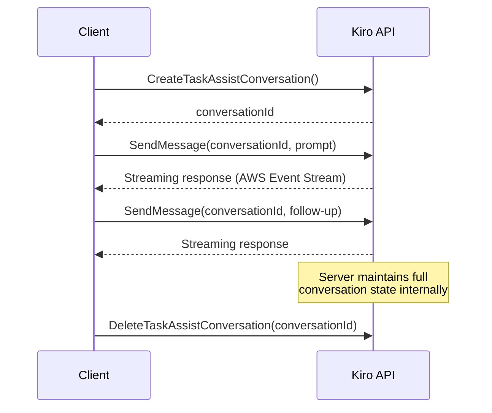

# Research Notes
{: .no_toc }

Technical research notes and findings from testing the Kiro API.

<details open markdown="block">
  <summary>Table of contents</summary>
  {: .text-delta }
1. TOC
{:toc}
</details>

---

## Prompt Caching

### Summary

The Kiro/CodeWhisperer API **does not support prompt caching**. After reviewing the AWS Language Servers open-source codebase — including the CodeWhisperer service contracts, the Q Developer streaming client, the chat session management layer, and the agentic chat controller — there is no evidence of any prompt caching mechanism exposed to API consumers.

### How Kiro Handles Conversations Instead

The Kiro API takes a fundamentally different approach from providers like Anthropic. Rather than exposing a stateless messages API with client-side caching hints, it uses a **server-managed conversation session model**:

1. The client calls `CreateTaskAssistConversation()` and receives a `conversationId`.
2. Each subsequent `SendMessage(conversationId, prompt)` only sends the new user turn.
3. The server holds the entire conversation history behind the `conversationId`.

This means:

- The server already has the full context and doesn't need to re-ingest it.
- There is no need for client-side cache hints because the server inherently avoids redundant processing.
- Any internal caching or optimization is opaque to the client.



### Evidence from API Service Contracts

The CodeWhisperer API is defined in two service model files (`bearer-token-service.json` for OAuth2 and `service.json` for AWS SigV4). All operations and request/response shapes were reviewed:

| Operation | Purpose | Cache-related fields |
|---|---|---|
| `GenerateCompletions` | Inline code completion | None |
| `CreateTaskAssistConversation` | Start chat session | None |
| `SendMessage` (streaming) | Chat turn | None |
| `StartTaskAssistCodeGeneration` | Code generation | None |
| `StartCodeAnalysis` | Security scanning | None |

No shape in either service definition contains `cache_control`, `cache_creation_input_tokens`, `cache_read_input_tokens`, or any similar field.

### Impact on rkgw

The gateway accepts requests in both OpenAI and Anthropic formats and converts them to Kiro format. When an Anthropic-format request includes `cache_control` annotations:

- `backend/src/models/anthropic.rs` parses the `cache_control` field so incoming requests deserialize correctly.
- `backend/src/converters/anthropic_to_kiro.rs` **silently drops** `cache_control` during conversion because the Kiro request format has no equivalent field.
- There is no way to forward prompt caching hints to the Kiro backend, and no usage response fields to relay cache hit/miss information back to the client.

### Anthropic vs Kiro API Comparison

| Feature | Anthropic API | Kiro/CodeWhisperer API |
|---|---|---|
| Client-side cache hints | `cache_control: {"type": "ephemeral"}` | Not supported |
| Cache usage reporting | `cache_creation_input_tokens`, `cache_read_input_tokens` | Not available |
| Conversation model | Stateless (client resends full history) | Stateful (server holds history via `conversationId`) |
| Internal optimization | Client-directed caching | Opaque, server-managed |

---

## Model Limits

### Purpose

`probe_limits` is a binary that empirically tests the context window and output token limits for each model supported by the gateway. Use it to determine the correct values for your OpenCode provider config.

The gateway must be running locally before you run this tool.

### Usage

```bash
# Probe a single model
cargo run --bin probe_limits --release -- --model claude-sonnet-4.6

# Probe all claude-* models
cargo run --bin probe_limits --release -- --all-models
```

### Environment Variables

| Variable | Default | Description |
|---|---|---|
| `PROXY_API_KEY` | *(required)* | Gateway API key |
| `GATEWAY_URL` | `http://127.0.0.1:8000` | Gateway base URL |

These are read from `.env` automatically if present.

### Why Models Stop Early

When the output cap shows `model stops early`, it means every request returned `finish_reason=stop` -- the model decided it was done before hitting `max_tokens`. There are two distinct causes:

**Thinking mode is on (most common).** When `FAKE_REASONING=true` (the default), the model spends most of its `max_tokens` budget on internal reasoning before writing a single word of output. The text response is short, the model finishes naturally, and `finish_reason=stop` every time. Fix: restart the gateway with thinking disabled before probing output limits:

```bash
FAKE_REASONING=false cargo run --release
```

**The prompt doesn't require long output.** Even with thinking off, if the prompt has a natural stopping point, the model finishes early. The probe uses a code generation prompt to encourage longer output, but some models still summarize instead of generating exhaustively. If you need a definitive output cap, use a prompt that forces continuation (e.g., prefill the assistant turn mid-sentence).

### Model Family Limits

When the probe can't determine the output cap empirically, use Anthropic's documented limits as a baseline. Kiro will silently clamp requests that exceed the real limit without returning an error.

| Model family | Standard max output tokens |
|---|---|
| Claude 3.x | 4,096 |
| Claude 4.x (Haiku, Sonnet) | 8,192 |
| Claude 4.x (Opus) | 8,192 |

### Notes on Context Probe Accuracy

- The binary search uses character count as a proxy for tokens (~4 chars/token). The reported token count comes from the gateway's tiktoken estimate, not Kiro's tokenizer directly.
- The `auto` model is skipped by default since it's a routing alias, not a real model with its own limits.

---

## Multi-Provider Architecture

### Summary

As of v1.0.8, the gateway supports multiple AI providers beyond the original Kiro (AWS CodeWhisperer) backend. Each user can connect credentials for multiple providers and set a priority order for fallback.

### Supported Providers

| Provider | Auth Method | Env Vars Required | Notes |
|---|---|---|---|
| **Kiro** (default) | AWS SSO device code flow | None (built-in) | Original provider, always available |
| **GitHub Copilot** | GitHub OAuth (authorization code) | `GITHUB_COPILOT_CLIENT_ID`, `GITHUB_COPILOT_CLIENT_SECRET`, `GITHUB_COPILOT_CALLBACK_URL` | Requires a registered GitHub OAuth App |
| **Qwen Coder** | Device code flow | `QWEN_OAUTH_CLIENT_ID` (optional, default public ID provided) | No client secret required |

### Architecture Decisions

**Per-user provider credentials.** Each user manages their own provider connections via the Profile page. Credentials are stored encrypted in PostgreSQL and cached in memory with TTL-based refresh.

**Provider priority.** Users set a priority order (e.g., Kiro > Copilot > Qwen). When a request arrives, the gateway resolves the user's highest-priority provider with valid credentials and routes the request there. If the top provider fails, it does not automatically fall back mid-request — the user must adjust priority or fix credentials.

**Provider registry pattern.** Providers are registered in `backend/src/providers/registry.rs` using a `ProviderRegistry`. Each provider implements a common trait for credential resolution and request proxying. Adding a new provider requires implementing the trait and registering it.

**OAuth relay for Copilot.** The Copilot OAuth flow uses a relay pattern: the backend initiates the GitHub OAuth redirect, and the callback is handled at `/_ui/api/copilot/callback`. The relay token mechanism (`provider_oauth.rs`) securely bridges the OAuth flow between the browser and backend.

**Device code flow for Qwen.** Similar to the Kiro device code flow, Qwen uses a polling-based device authorization. The frontend polls `/_ui/api/qwen/poll` until the user completes authorization in their browser.

### Impact on Request Flow

The request flow now includes a provider resolution step:

1. API key auth → resolve user
2. Check user's provider priority list
3. Get credentials for highest-priority available provider
4. Convert request to provider's format (Kiro, Copilot, or Qwen)
5. Proxy to provider API
6. Convert response back to OpenAI/Anthropic format
