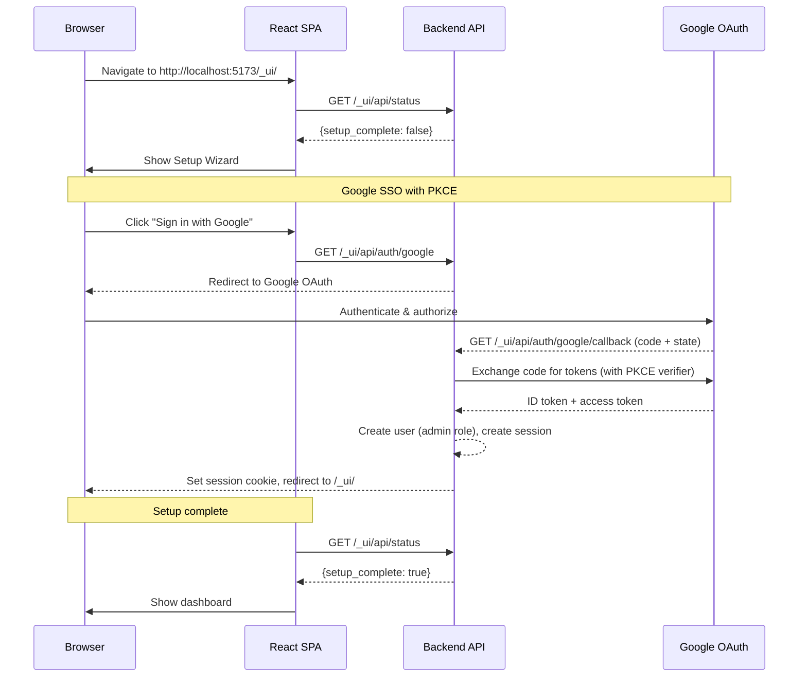

# Web Dashboard

The Kiro Gateway includes a web dashboard served as a React single-page application (SPA) at `/_ui/`. It provides a browser-based interface for initial setup, user management, configuration, real-time metrics monitoring, and log streaming.

---

## Overview

The frontend is a React 19 SPA built with Vite and TypeScript. In development, the Vite dev server serves the SPA and proxies API requests to the Rust backend. Authentication uses Google SSO with PKCE for web UI access, and per-user API keys for programmatic access.

```mermaid
flowchart TB
    subgraph Browser["Browser (React SPA)"]
        Login[Login Page]
        Profile[Profile Page]
        Config[Config Manager]
        Admin[Admin Panel]
        Guardrails[Guardrails Config]
    end

    subgraph Vite["Vite Dev Server (:5173)"]
        Static["/_ui/* → React SPA"]
        Proxy["/_ui/api/* → backend:9999"]
    end

    subgraph Backend["Rust Backend (HTTP :9999)"]
        subgraph PublicAPI["Public API (no auth)"]
            StatusAPI[GET /status]
            GoogleAuth[GET /auth/google]
            GoogleCB[GET /auth/google/callback]
        end
        subgraph SessionAPI["Session-Authenticated API"]
            AuthMe[GET /auth/me]
            ConfigRead[GET /config]
            SchemaAPI[GET /config/schema]
            SystemAPI[GET /system]
            ModelsAPI[GET /models]
            KiroRoutes[Kiro token mgmt]
            KeyRoutes[API key mgmt]
            CopilotRoutes[Copilot OAuth]
            QwenRoutes[Qwen device flow]
            ProviderPriority[Provider priority]
        end
        subgraph AdminAPI["Admin API (+ CSRF)"]
            ConfigWrite[PUT /config]
            UserMgmt[User Management]
            DomainAllow[Domain Allowlist]
            GuardrailsAdmin[Guardrails CRUD]
        end
    end

    Browser -->|HTTP| Vite
    Static --> Browser
    Proxy --> Backend
    Login --> GoogleAuth
    Profile --> KiroRoutes
    Profile --> CopilotRoutes
    Profile --> QwenRoutes
    Profile --> ProviderPriority
    Profile --> KeyRoutes
    Config --> ConfigRead
    Config --> ConfigWrite
    Admin --> UserMgmt
    Guardrails --> GuardrailsAdmin
```



---

## Accessing the Dashboard

Once the gateway is running via `docker compose up -d`, open your browser and navigate to:

```
https://your-domain/_ui/
```

In development, access via `http://localhost:5173/_ui/`. The Vite dev server proxies API requests to the backend.

---

## Authentication

The web dashboard uses **Google SSO** with PKCE (Proof Key for Code Exchange) and OpenID Connect for authentication. There is no password or API key login for the web UI.

### Login Flow

1. Navigate to `/_ui/` — the SPA redirects unauthenticated users to the login page
2. Click "Sign in with Google" — initiates the PKCE flow
3. Authenticate with your Google account — the OAuth callback returns to the gateway
4. A session cookie (`kgw_session`) is set with a 24-hour TTL
5. A CSRF token cookie is also set for mutation protection

### Roles

The gateway supports two user roles:

| Role | Capabilities |
|------|-------------|
| **Admin** | Full access: view metrics/logs, manage configuration, manage users, manage domain allowlist, manage own API keys and Kiro tokens |
| **User** | Standard access: view metrics/logs, view configuration, manage own API keys and Kiro tokens |

The first user to complete Google SSO setup is automatically assigned the **Admin** role.

### Session Management

- Sessions are stored in an in-memory cache (`session_cache` in AppState)
- Session cookie: `kgw_session` with 24-hour TTL
- CSRF token: separate cookie, required for all mutation endpoints (POST, PUT, DELETE)
- Use `GET /_ui/api/auth/me` to check current session status and user info
- Use `POST /_ui/api/auth/logout` to end the session

---

## Pages

The Web UI is organized into the following pages, accessible via the sidebar navigation:

### Profile (`/_ui/profile`)

The default landing page after login. Each user manages their own credentials and settings here:

- **Provider Credentials** — Connect and manage AI provider accounts:
  - **Kiro (AWS)** — Connect via AWS SSO device code flow. Shows connection status and allows disconnect/reconnect.
  - **GitHub Copilot** — Connect via GitHub OAuth (only available if `GITHUB_COPILOT_CLIENT_ID` is configured server-side). Shows connection status.
  - **Qwen Coder** — Connect via device code flow (only available if `QWEN_OAUTH_CLIENT_ID` is configured). Shows device code URL for browser authorization.
- **Provider Priority** — Drag-and-drop reordering of provider fallback priority. The gateway uses the first provider with valid credentials.
- **API Keys** — Create, list, and revoke personal API keys for programmatic access to `/v1/*` endpoints.
- **Kiro Token Management** — Legacy per-user Kiro token management (device code flow).

### Configuration (`/_ui/config`) — Admin Only

Gateway runtime configuration management:

- View all configuration settings with current values
- Edit settings with immediate hot-reload (where supported)
- Configuration schema with field types, descriptions, and validation rules
- Configuration change history with timestamps and old/new values

### Guardrails (`/_ui/guardrails`) — Admin Only

Content safety configuration powered by AWS Bedrock:

- **Profiles** — Create and manage AWS Bedrock guardrail connections (guardrail ID, version, region, AWS credentials). Enable/disable individually. Test profiles against sample content.
- **Rules** — Define when guardrails apply using CEL expressions. Configure apply direction (input/output/both), sampling rate, timeout, and linked profiles. Validate CEL syntax before saving.

### Admin (`/_ui/admin`) — Admin Only

User and access management:

- **User List** — View all registered users with their roles, status, and last login.
- **User Detail** (`/_ui/admin/users/:userId`) — View individual user details, change roles (Admin/User), manage user status.
- **Domain Allowlist** — Restrict Google SSO sign-in to specific email domains.

### Login (`/_ui/login`)

Google SSO login page with PKCE flow. Unauthenticated users are redirected here automatically.

---

## Setup Wizard

When the gateway starts for the first time with no admin user in the database, it enters **setup-only mode**. The proxy API endpoints (`/v1/*`) return `503 Service Unavailable` until setup is complete.

### Setup Flow



### Step-by-Step Walkthrough

1. **Navigate to the web UI** — The SPA detects that setup is incomplete and shows the setup wizard

2. **Sign in with Google** — Click the sign-in button to start the Google SSO flow. The gateway uses PKCE for security. You must use a Google account that matches the allowed domain (if domain allowlisting is configured).

3. **First user becomes admin** — After successful Google authentication, the first user is created with the **Admin** role. Setup is marked complete, and the proxy endpoints (`/v1/*`) become available.

4. **Configure Kiro credentials** — After setup, navigate to the Kiro token management section to provide your Kiro (AWS CodeWhisperer) credentials for API proxying.

---

## Configuration Management

After setup, admin users can manage gateway configuration through the dashboard.

### Viewing Configuration

The current configuration is available via `GET /_ui/api/config`, which returns all settings with their current values. The schema endpoint (`GET /_ui/api/config/schema`) provides field metadata including types, descriptions, and validation rules.

### Updating Configuration

Configuration changes are submitted via `PUT /_ui/api/config` (admin-only, requires CSRF token) with a JSON body containing the fields to update:

```json
{
  "log_level": "debug",
  "debug_mode": "errors",
  "truncation_recovery": true
}
```

### Configuration History

The `GET /_ui/api/config/history` endpoint returns a log of all configuration changes, allowing you to track when and what was modified.

---

## User & Access Management

### Per-User API Keys

Each user can create their own API keys for programmatic access to the `/v1/*` proxy endpoints. API keys are managed through the dashboard or via the `/_ui/api/` key management endpoints.

- Keys are stored as SHA-256 hashes in PostgreSQL
- Keys are cached in memory (`api_key_cache`) for fast lookup
- Clients authenticate with `Authorization: Bearer <api-key>` or `x-api-key: <api-key>`
- Each API key is associated with the user who created it, enabling per-user Kiro credential resolution

### Per-User Kiro Tokens

Each user manages their own Kiro (AWS CodeWhisperer) credentials. When a request arrives with a user's API key, the gateway uses that user's Kiro tokens to proxy the request.

- Kiro tokens are cached in memory (`kiro_token_cache`) with a 4-minute TTL
- Tokens auto-refresh before expiry
- Managed via the Kiro token routes in the dashboard

### Multi-Provider Credentials

In addition to Kiro, users can connect GitHub Copilot and Qwen Coder accounts on the Profile page:

- **GitHub Copilot** — OAuth authorization code flow. Requires server-side configuration (`GITHUB_COPILOT_CLIENT_ID`, `GITHUB_COPILOT_CLIENT_SECRET`, `GITHUB_COPILOT_CALLBACK_URL`).
- **Qwen Coder** — Device code flow. Requires `QWEN_OAUTH_CLIENT_ID` in server configuration.
- **Provider Priority** — Users set a priority order for provider fallback. The gateway routes requests to the highest-priority provider with valid credentials.

### Domain Allowlist (Admin)

Admins can configure a domain allowlist to restrict which Google accounts can sign in. Only email addresses matching an allowed domain will be permitted to create accounts.

### User Management (Admin)

Admins can view all users, change roles (admin/user), and remove users through the user management panel.

---

## Real-Time Metrics

The metrics dashboard provides live monitoring of gateway performance via Server-Sent Events (SSE).

### Metrics Stream

Connect to `GET /_ui/api/stream/metrics` (requires session auth) to receive metrics snapshots every 1 second. Each event contains:

```json
{
  "total_requests": 1542,
  "active_requests": 3,
  "total_tokens_in": 245000,
  "total_tokens_out": 189000,
  "avg_latency_ms": 1250,
  "error_count": 12,
  "models": {
    "claude-sonnet-4-20250514": {
      "requests": 800,
      "tokens_in": 150000,
      "tokens_out": 120000
    }
  }
}
```

### System Information

The `GET /_ui/api/system` endpoint provides process-level system metrics:
- CPU usage (percentage)
- Memory consumption (bytes)
- Process uptime

### Available Models

The `GET /_ui/api/models` endpoint returns the list of models currently available through the Kiro API backend, useful for verifying that authentication is working and seeing which models you can use.

---

## Log Streaming

The log viewer provides real-time log streaming via SSE at `GET /_ui/api/stream/logs`.

### How It Works

The gateway captures logs via a tracing layer (`log_capture` module) into an in-memory buffer (`log_buffer` in AppState). The SSE endpoint polls this buffer and emits new entries. Each log event contains an array of new entries:

```json
[
  {
    "timestamp": "2026-03-01T12:00:00.000Z",
    "level": "INFO",
    "message": "Request completed: model=claude-sonnet-4-20250514 tokens=1500 latency=1.2s"
  },
  {
    "timestamp": "2026-03-01T12:00:01.000Z",
    "level": "DEBUG",
    "message": "Token refresh: expires_in=3600s"
  }
]
```

### Historical Logs

The `GET /_ui/api/logs` endpoint returns the current contents of the log buffer as a JSON array, useful for loading initial log history when the dashboard first opens.

---

## Content Guardrails Management

The Content Guardrails system provides content validation powered by AWS Bedrock guardrails with a flexible CEL (Common Expression Language) rule engine. This section is admin-only.

### Guardrail Profiles

A profile represents a connection to an AWS Bedrock guardrail. To create a profile, provide:

- **Name** — A descriptive name for the profile
- **Guardrail ID** — The AWS Bedrock guardrail identifier
- **Guardrail Version** — The version of the guardrail to use (e.g., `1`)
- **Region** — AWS region where the guardrail is deployed (e.g., `us-east-1`)
- **AWS Credentials** — Access key and secret key for authenticating with Bedrock (displayed masked in the UI)

Profiles can be enabled or disabled individually.

### Guardrail Rules

Rules define when and how guardrails are applied. Each rule includes:

- **Name and Description** — Identifies the rule's purpose
- **CEL Expression** — A condition that determines which requests the rule applies to (leave empty to match all requests)
- **Apply To** — Whether to validate input (before sending to Kiro), output (before returning to client), or both
- **Sampling Rate** — Percentage of matching requests to validate (0–100%). Use lower values for high-traffic scenarios
- **Timeout** — Maximum time to wait for Bedrock validation per rule
- **Linked Profiles** — One or more guardrail profiles to apply when this rule matches

Rules can be enabled or disabled individually.

### CEL Expression Variables

The following variables are available in CEL expressions:

| Variable | Type | Description |
|----------|------|-------------|
| `request.model` | string | Model name (e.g., `claude-sonnet-4-20250514`) |
| `request.api_format` | string | API format (`openai` or `anthropic`) |
| `request.message_count` | int | Number of messages in the conversation |
| `request.has_tools` | bool | Whether the request includes tool definitions |
| `request.is_streaming` | bool | Whether streaming is enabled |
| `request.content_length` | int | Total content length in bytes |

**Example expressions:**
- `request.model == "claude-opus-4"` — Only apply to a specific model
- `request.message_count > 5 && request.has_tools` — Apply to longer tool-using conversations
- `request.api_format == "openai"` — Apply only to OpenAI-format requests

### Testing

- **Test a profile** — Submit sample content against a specific profile to verify it's working correctly. Returns the guardrail action and response time.
- **Validate CEL expression** — Check that a CEL expression compiles without errors before saving a rule.

### Fail-Open Design

Guardrails are designed to fail open — if a Bedrock API call fails or times out, the request proceeds without blocking. This prevents guardrail infrastructure issues from causing outages.

**Note:** Output validation is only available for non-streaming requests. Streaming responses bypass output guardrail checks by design.

---

## API Endpoint Reference

All web UI API endpoints are nested under `/_ui/api/`.

### Public Endpoints (No Authentication)

| Method | Path | Description |
|---|---|---|
| `GET` | `/_ui/api/status` | Gateway status (includes `setup_complete` flag) |
| `GET` | `/_ui/api/auth/google` | Initiate Google SSO PKCE flow |
| `GET` | `/_ui/api/auth/google/callback` | Google OAuth callback handler |

### Session-Authenticated Endpoints

These require a valid `kgw_session` cookie (obtained via Google SSO).

| Method | Path | Description |
|---|---|---|
| `GET` | `/_ui/api/auth/me` | Current user info and session status |
| `GET` | `/_ui/api/metrics` | Current metrics snapshot |
| `GET` | `/_ui/api/system` | System info (CPU, memory, uptime) |
| `GET` | `/_ui/api/models` | List available models |
| `GET` | `/_ui/api/logs` | Get log buffer contents |
| `GET` | `/_ui/api/config` | Get current configuration |
| `GET` | `/_ui/api/config/schema` | Configuration field schema |
| `GET` | `/_ui/api/config/history` | Configuration change history |
| `GET` | `/_ui/api/stream/metrics` | SSE metrics stream |
| `GET` | `/_ui/api/stream/logs` | SSE log stream |

### Mutation Endpoints (Session + CSRF Token)

These require a valid session and CSRF token.

| Method | Path | Description |
|---|---|---|
| `POST` | `/_ui/api/auth/logout` | End current session |
| `*` | `/_ui/api/kiro/*` | Kiro token management (per-user) |
| `*` | `/_ui/api/keys/*` | API key management (per-user) |
| `*` | `/_ui/api/copilot/*` | GitHub Copilot OAuth connect/disconnect (per-user) |
| `*` | `/_ui/api/qwen/*` | Qwen Coder device flow connect/disconnect (per-user) |
| `*` | `/_ui/api/providers/*` | Provider OAuth relay and priority management (per-user) |

### Admin-Only Endpoints (Session + CSRF + Admin Role)

| Method | Path | Description |
|---|---|---|
| `PUT` | `/_ui/api/config` | Update gateway configuration |
| `*` | `/_ui/api/domains/*` | Domain allowlist management |
| `*` | `/_ui/api/users/*` | User management |
| `*` | `/_ui/api/admin/guardrails/*` | Guardrails profile/rule management |

---

## Architecture

The web UI is implemented across several Rust modules in `backend/src/web_ui/`:

- **`mod.rs`** — Router construction, separating public, session-authenticated, and admin routes
- **`routes.rs`** — API HTTP handlers
- **`google_auth.rs`** — Google SSO with PKCE flow (OpenID Connect)
- **`session.rs`** — Session cookie management and CSRF validation
- **`api_keys.rs`** — Per-user API key CRUD (create, list, revoke)
- **`user_kiro.rs`** — Per-user Kiro token management
- **`copilot_auth.rs`** — GitHub Copilot OAuth connect/callback/status/disconnect
- **`qwen_auth.rs`** — Qwen Coder device flow connect/poll/status/disconnect
- **`provider_oauth.rs`** — Multi-provider OAuth relay and public callback routes
- **`provider_priority.rs`** — Per-user provider priority ordering
- **`users.rs`** — User management (admin)
- **`config_api.rs`** — Configuration validation, change classification, and field descriptions
- **`config_db.rs`** — PostgreSQL persistence layer for configuration key-value storage

The React frontend source lives in `frontend/` (Vite + TypeScript). In development, the Vite dev server serves the SPA and proxies API requests to the backend.
