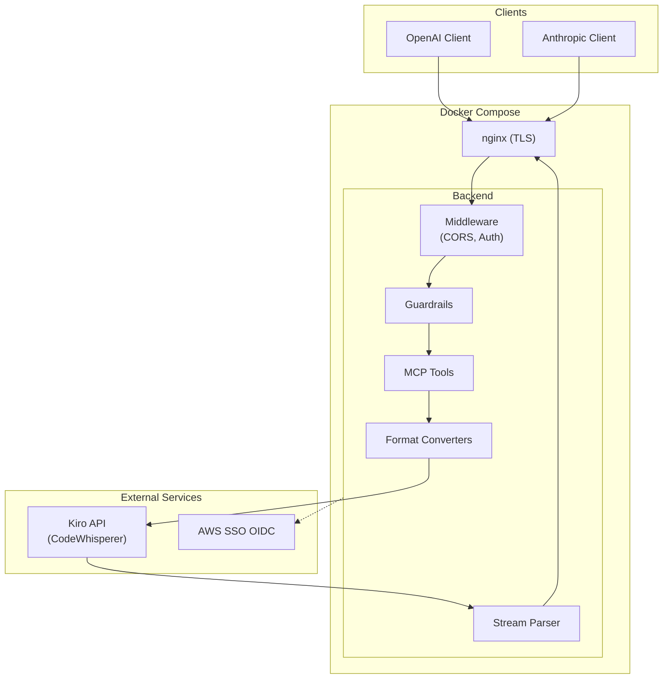

<div class="hero" markdown="0">
  <h1>Kiro Gateway</h1>
  <p class="tagline">
    A multi-user Rust proxy that lets you use OpenAI and Anthropic client libraries
    with the Kiro API (AWS CodeWhisperer) backend. Deployed via Docker Compose with automated TLS.
  </p>
  <div class="badges">
    <span class="badge badge--infra">Rust</span>
    <span class="badge badge--infra">Axum 0.7</span>
    <span class="badge badge--api">OpenAI Compatible</span>
    <span class="badge badge--api">Anthropic Compatible</span>
    <span class="badge badge--core">Streaming</span>
    <span class="badge badge--security">Multi-User</span>
    <span class="badge badge--core">MCP Gateway</span>
    <span class="badge badge--security">Content Guardrails</span>
  </div>
</div>

## How It Works

Kiro Gateway sits between your existing AI client code and the Kiro API. Send requests in OpenAI or Anthropic format -- the gateway translates them on the fly, handles per-user authentication, and streams responses back in the format your client expects.



## Features

<div class="features" markdown="0">
  <div class="feature-card" data-cat="api">
    <h3>
      <span class="fc-icon"><svg width="16" height="16" xmlns="http://www.w3.org/2000/svg" viewBox="0 0 24 24" fill="none" stroke="currentColor" stroke-width="2" stroke-linecap="round" stroke-linejoin="round"><path d="M8 3L4 7l4 4"/><path d="M16 3l4 4-4 4"/><line x1="4" y1="7" x2="20" y2="7"/><path d="M8 13l-4 4 4 4"/><path d="M16 13l4 4-4 4"/><line x1="4" y1="17" x2="20" y2="17"/></svg></span>
      OpenAI Compatible
    </h3>
    <p>Drop-in replacement for the OpenAI API. Use any OpenAI client library -- just point it at the gateway.</p>
  </div>
  <div class="feature-card" data-cat="api">
    <h3>
      <span class="fc-icon"><svg width="16" height="16" xmlns="http://www.w3.org/2000/svg" viewBox="0 0 24 24" fill="none" stroke="currentColor" stroke-width="2" stroke-linecap="round" stroke-linejoin="round"><path d="M8 3L4 7l4 4"/><path d="M16 3l4 4-4 4"/><line x1="4" y1="7" x2="20" y2="7"/><path d="M8 13l-4 4 4 4"/><path d="M16 13l4 4-4 4"/><line x1="4" y1="17" x2="20" y2="17"/></svg></span>
      Anthropic Compatible
    </h3>
    <p>Full support for the Anthropic Messages API, including system prompts, tool use, and content blocks.</p>
  </div>
  <div class="feature-card" data-cat="core">
    <h3>
      <span class="fc-icon"><svg width="16" height="16" xmlns="http://www.w3.org/2000/svg" viewBox="0 0 24 24" fill="none" stroke="currentColor" stroke-width="2" stroke-linecap="round" stroke-linejoin="round"><polyline points="22 12 18 12 15 21 9 3 6 12 2 12"/></svg></span>
      Real-time Streaming
    </h3>
    <p>Parses Kiro's AWS Event Stream binary format and converts to standard SSE in real time.</p>
  </div>
  <div class="feature-card" data-cat="security">
    <h3>
      <span class="fc-icon"><svg width="16" height="16" xmlns="http://www.w3.org/2000/svg" viewBox="0 0 24 24" fill="none" stroke="currentColor" stroke-width="2" stroke-linecap="round" stroke-linejoin="round"><path d="M17 21v-2a4 4 0 0 0-4-4H5a4 4 0 0 0-4 4v2"/><circle cx="9" cy="7" r="4"/><path d="M23 21v-2a4 4 0 0 0-3-3.87"/><path d="M16 3.13a4 4 0 0 1 0 7.75"/></svg></span>
      Multi-User Auth
    </h3>
    <p>Google SSO for web UI access, per-user API keys for programmatic access. Role-based access control (Admin/User).</p>
  </div>
  <div class="feature-card" data-cat="core">
    <h3>
      <span class="fc-icon"><svg width="16" height="16" xmlns="http://www.w3.org/2000/svg" viewBox="0 0 24 24" fill="none" stroke="currentColor" stroke-width="2" stroke-linecap="round" stroke-linejoin="round"><path d="M12 2a8 8 0 0 0-8 8c0 3.4 2.1 6.3 5 7.4V20h6v-2.6c2.9-1.1 5-4 5-7.4a8 8 0 0 0-8-8z"/><line x1="12" y1="2" x2="12" y2="6"/><line x1="4.93" y1="4.93" x2="7.76" y2="7.76"/><line x1="19.07" y1="4.93" x2="16.24" y2="7.76"/></svg></span>
      Extended Thinking
    </h3>
    <p>Extracts reasoning blocks from model responses and maps them to native thinking/reasoning content fields.</p>
  </div>
  <div class="feature-card" data-cat="feature">
    <h3>
      <span class="fc-icon"><svg width="16" height="16" xmlns="http://www.w3.org/2000/svg" viewBox="0 0 24 24" fill="none" stroke="currentColor" stroke-width="2" stroke-linecap="round" stroke-linejoin="round"><rect x="3" y="3" width="7" height="7"/><rect x="14" y="3" width="7" height="7"/><rect x="14" y="14" width="7" height="7"/><rect x="3" y="14" width="7" height="7"/></svg></span>
      Web Dashboard
    </h3>
    <p>Built-in web UI for configuration, user management, API key management, and real-time log streaming.</p>
  </div>
  <div class="feature-card" data-cat="core">
    <h3>
      <span class="fc-icon"><svg width="16" height="16" xmlns="http://www.w3.org/2000/svg" viewBox="0 0 24 24" fill="none" stroke="currentColor" stroke-width="2" stroke-linecap="round" stroke-linejoin="round"><rect x="2" y="2" width="20" height="8" rx="2" ry="2"/><rect x="2" y="14" width="20" height="8" rx="2" ry="2"/><line x1="6" y1="6" x2="6.01" y2="6"/><line x1="6" y1="18" x2="6.01" y2="18"/></svg></span>
      MCP Gateway
    </h3>
    <p>Connect external MCP tool servers over HTTP, SSE, or STDIO. Tools are automatically discovered and injected into chat requests with per-request filtering.</p>
  </div>
  <div class="feature-card" data-cat="security">
    <h3>
      <span class="fc-icon"><svg width="16" height="16" xmlns="http://www.w3.org/2000/svg" viewBox="0 0 24 24" fill="none" stroke="currentColor" stroke-width="2" stroke-linecap="round" stroke-linejoin="round"><path d="M12 22s8-4 8-10V5l-8-3-8 3v7c0 6 8 10 8 10z"/><polyline points="9 12 11 14 15 10"/></svg></span>
      Content Guardrails
    </h3>
    <p>AWS Bedrock-powered content validation with CEL rule engine. Validate input before sending and output before returning, with configurable sampling and fail-open design.</p>
  </div>
</div>

## Quick Start

```bash
# Clone and configure
git clone https://github.com/if414013/rkgw.git
cd rkgw
cp .env.example .env
# Edit .env with your domain, Google OAuth credentials, etc.

# Provision TLS certificates
./init-certs.sh

# Start all services
docker compose up -d --build
```

Then open `https://your-domain.com/_ui/` to complete setup via Google SSO.

## Documentation

<div class="nav-cards" markdown="0">
  <a href="{{ site.baseurl }}/docs/getting-started" class="nav-card">
    <span class="nav-icon">&gt;</span>
    Getting Started
  </a>
  <a href="{{ site.baseurl }}/docs/architecture" class="nav-card">
    <span class="nav-icon">#</span>
    Architecture
  </a>
  <a href="{{ site.baseurl }}/docs/api-reference" class="nav-card">
    <span class="nav-icon">/</span>
    API Reference
  </a>
  <a href="{{ site.baseurl }}/docs/modules" class="nav-card">
    <span class="nav-icon">{}</span>
    Modules
  </a>
  <a href="{{ site.baseurl }}/docs/deployment" class="nav-card">
    <span class="nav-icon">$</span>
    Deployment
  </a>
  <a href="{{ site.baseurl }}/docs/troubleshooting" class="nav-card">
    <span class="nav-icon">?</span>
    Troubleshooting
  </a>
</div>

## API Endpoints

| Endpoint | Method | Description |
|----------|--------|-------------|
| `/v1/chat/completions` | POST | OpenAI-compatible chat completions |
| `/v1/messages` | POST | Anthropic-compatible messages |
| `/v1/models` | GET | List available models |
| `/v1/mcp/tool/execute` | POST | Execute MCP tool |
| `/mcp` | POST/GET | MCP JSON-RPC protocol |
| `/health` | GET | Health check |
| `/_ui/` | GET | Web dashboard |
