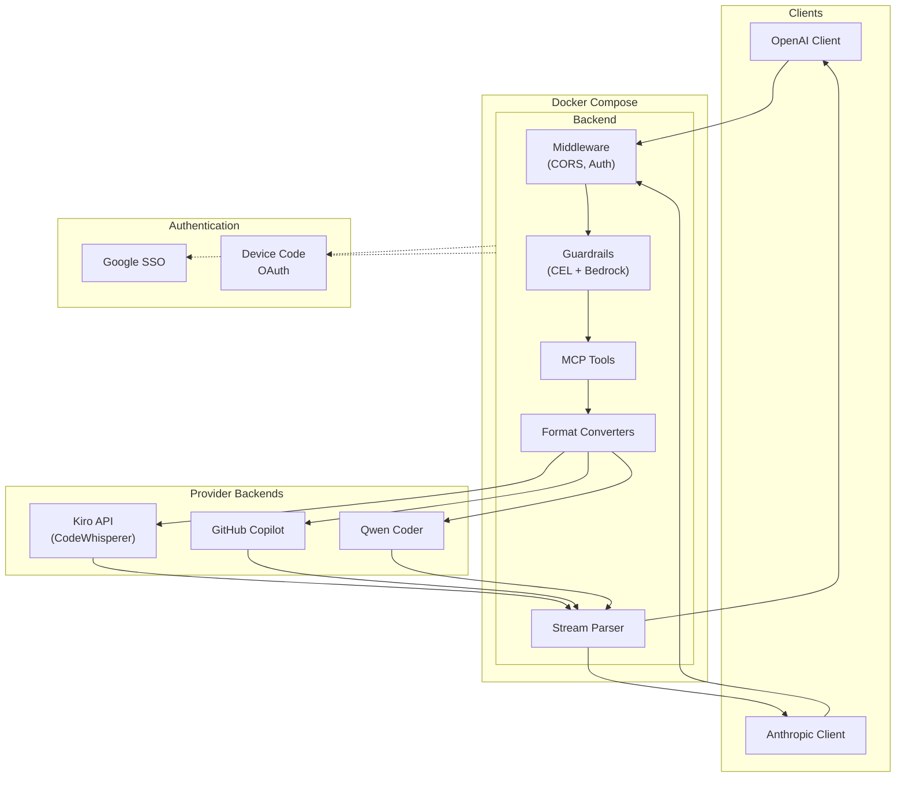

<div class="hero" markdown="0">
  <h1>Harbangan</h1>
  <p class="tagline">
    A multi-user, multi-provider Rust proxy gateway. Use OpenAI and Anthropic client libraries
    with Kiro, GitHub Copilot, and Qwen Coder backends. Per-user auth, content guardrails,
    MCP tool gateway, and real-time streaming — deployed via Docker Compose.
  </p>
  <div class="badges">
    <span class="badge badge--infra">Rust</span>
    <span class="badge badge--infra">Axum 0.7</span>
    <span class="badge badge--api">OpenAI Compatible</span>
    <span class="badge badge--api">Anthropic Compatible</span>
    <span class="badge badge--core">Streaming</span>
    <span class="badge badge--security">Multi-User RBAC</span>
    <span class="badge badge--core">MCP Gateway</span>
    <span class="badge badge--security">Content Guardrails</span>
    <span class="badge badge--provider">Kiro</span>
    <span class="badge badge--provider">Copilot</span>
    <span class="badge badge--provider">Qwen Coder</span>
  </div>
</div>

## The Name

In Batak Toba culture, the *harbangan* is the gate of the traditional house — a threshold between the ordered world of family and community, and the open world beyond. In Batak cosmology, the universe is divided into three realms, and every threshold mirrors that cosmic boundary. To cross a *harbangan* is to move between states of being.

This gateway embodies the same philosophy:

- **Cosmic boundary** — The *harbangan* separates the three realms of Batak cosmology. This gateway sits at the boundary between your client code and multiple provider backends (Kiro, Copilot, Qwen), translating between OpenAI and Anthropic formats on either side.
- **Guardian of social order** — The Batak gate enforces *Dalihan Na Tolu*, the three-pillar kinship system that governs who may enter and how. Harbangan enforces multi-user RBAC: Google SSO, per-user API keys, admin/user roles, and domain allowlisting decide what passes through.
- **Ritual transition** — Crossing a *harbangan* signals a shift in status. Requests crossing this gateway undergo their own transformation: format conversion, content guardrails (CEL rules + AWS Bedrock), and MCP tool injection before reaching the other side.
- **Openness as moral virtue** — In Batak ethics, a gate that is always open signals generosity and communal spirit. This one is open source, and in proxy-only mode, a single container is all you need to open the gate.

> Further reading on Batak Toba philosophy: [Form and Meaning of Batak Toba House](https://repository.petra.ac.id/18044/1/Publikasi1_03007_4499.pdf) · [Dalihan Na Tolu: Vision of Integrity](https://journalppw.com/index.php/jpsp/article/download/12366/8016/14827) · [Batak Cultural Values](https://ojs.unimal.ac.id/mspr/article/download/10948/4863)

## How It Works

Harbangan sits between your existing AI client code and multiple provider backends. Send requests in OpenAI or Anthropic format -- the gateway translates them on the fly, handles per-user authentication with role-based access control, applies content guardrails, injects MCP tools, and streams responses back in the format your client expects.



## Features

<div class="features" markdown="0">
  <div class="feature-card" data-cat="api">
    <h3><span class="fc-icon">&harr;</span> OpenAI Compatible</h3>
    <p>Drop-in replacement for the OpenAI API. Use any OpenAI client library -- just point it at the gateway.</p>
  </div>
  <div class="feature-card" data-cat="api">
    <h3><span class="fc-icon">&harr;</span> Anthropic Compatible</h3>
    <p>Full support for the Anthropic Messages API, including system prompts, tool use, and content blocks.</p>
  </div>
  <div class="feature-card" data-cat="provider">
    <h3><span class="fc-icon">&#9670;</span> Multi-Provider</h3>
    <p>Connect to Kiro (AWS CodeWhisperer), GitHub Copilot, and Qwen Coder backends. Per-user credentials with automatic token refresh.</p>
  </div>
  <div class="feature-card" data-cat="core">
    <h3><span class="fc-icon">&sim;</span> Real-time Streaming</h3>
    <p>Parses provider-specific binary formats and converts to standard SSE in real time. Supports AWS Event Stream and chunked transfer.</p>
  </div>
  <div class="feature-card" data-cat="security">
    <h3><span class="fc-icon">&#9899;</span> Multi-User RBAC</h3>
    <p>Google SSO for web UI, per-user API keys for programmatic access. Admin and User roles with domain allowlisting.</p>
  </div>
  <div class="feature-card" data-cat="core">
    <h3><span class="fc-icon">&#10023;</span> Extended Thinking</h3>
    <p>Extracts reasoning blocks from model responses and maps them to native thinking/reasoning content fields.</p>
  </div>
  <div class="feature-card" data-cat="core">
    <h3><span class="fc-icon">&#8644;</span> MCP Gateway</h3>
    <p>Connect external MCP tool servers over HTTP, SSE, or STDIO. Tools are automatically discovered and injected into chat requests.</p>
  </div>
  <div class="feature-card" data-cat="security">
    <h3><span class="fc-icon">&#9681;</span> Content Guardrails</h3>
    <p>AWS Bedrock-powered content validation with CEL rule engine. Validate input and output with configurable sampling and fail-open design.</p>
  </div>
  <div class="feature-card" data-cat="feature">
    <h3><span class="fc-icon">&#9638;</span> Web Dashboard</h3>
    <p>Built-in CRT-styled web UI for configuration, user management, API keys, provider setup, and real-time log streaming.</p>
  </div>
  <div class="feature-card" data-cat="feature">
    <h3><span class="fc-icon">&#9654;</span> Proxy-Only Mode</h3>
    <p>Single-container deployment with no database or SSO required. Device code OAuth flow for quick setup behind any reverse proxy.</p>
  </div>
</div>

## Quick Start

```bash
# Clone and configure
git clone https://github.com/if414013/harbangan.git
cd harbangan
cp .env.example .env
# Edit .env with your Google OAuth credentials, etc.

# Start all services
docker compose up -d --build
```

Then open `https://your-domain.com/_ui/` to complete setup via Google SSO.

For proxy-only mode (no database, single container):

```bash
docker compose -f docker-compose.gateway.yml --env-file .env.proxy up -d
```

## Documentation

<div class="nav-cards" markdown="0">
  <a href="{{ site.baseurl }}/docs/getting-started" class="nav-card">
    <span class="nav-icon">&gt;</span>
    Getting Started
  </a>
  <a href="{{ site.baseurl }}/docs/architecture" class="nav-card">
    <span class="nav-icon">#</span>
    Architecture
  </a>
  <a href="{{ site.baseurl }}/docs/api-reference" class="nav-card">
    <span class="nav-icon">/</span>
    API Reference
  </a>
  <a href="{{ site.baseurl }}/docs/client-setup" class="nav-card">
    <span class="nav-icon">~</span>
    Client Setup
  </a>
  <a href="{{ site.baseurl }}/docs/deployment" class="nav-card">
    <span class="nav-icon">$</span>
    Deployment
  </a>
  <a href="{{ site.baseurl }}/docs/troubleshooting" class="nav-card">
    <span class="nav-icon">?</span>
    Troubleshooting
  </a>
</div>

## API Endpoints

| Endpoint | Method | Description |
|----------|--------|-------------|
| `/v1/chat/completions` | POST | OpenAI-compatible chat completions |
| `/v1/messages` | POST | Anthropic-compatible messages |
| `/v1/models` | GET | List available models |
| `/health` | GET | Health check |
| `/_ui/` | GET | Web dashboard |
